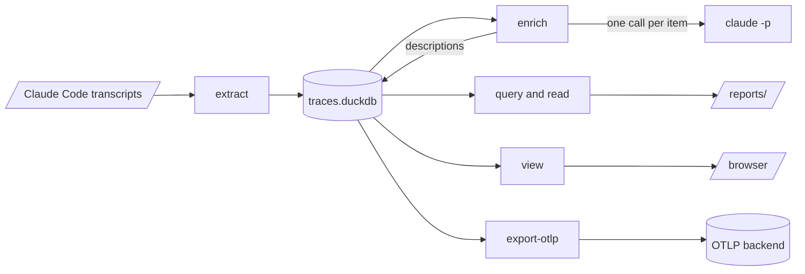

# aiobserve 🔭

Analyze AI coding agents from their own telemetry, to find ways to make them faster, cheaper, and better at the work.

Coding sessions leave a detailed trail: every tool call, every file read, every retry, every token. aiobserve extracts that trail — mostly as OpenTelemetry traces — turns it into something queryable, and produces findings you can act on: where time goes, where cost goes, which guidance the agent ignores, which tools it fumbles.

The first target is **Claude Code**. The tool takes a project path, so it works on any repository; `~/repos/mycelia` is just the first corpus.

## Status

Early, and running end to end for Claude Code. Transcripts extract into a local DuckDB store — sessions, turns, API calls, tool calls, subagent runs, compactions, cost, and every raw line. A second pass describes each run, turn, and session in the model's words, so findings can filter on meaning. A local viewer serves the store in a browser, and an exporter ships it to any OTLP backend. Findings from the analysis iterations run so far are committed under `reports/`, one per iteration; [the report guide](reports/README.md) says how to read one and how to write the next.

What is still missing: the spans Claude Code itself exports over OpenTelemetry. Nothing imports them yet, so every number here comes from transcripts.



Each stage has a guide: [the store](docs/store.md), [enrichment](docs/enrichment.md), [analysis](docs/analysis.md), [the viewer](docs/viewer.md), [OTLP export](docs/otlp-export.md).

## Getting started

```bash
mise run sync     # install the virtualenv from uv.lock
mise run check    # format, lint, type-check, test
```

Every task lives in `mise.toml`. `mise run check-fast` is the loop while you iterate.

## Where session data lives

Claude Code writes one JSON-per-line transcript per session:

```
~/.claude/projects/<encoded-cwd>/<session-id>.jsonl
~/.claude/projects/<encoded-cwd>/<session-id>/subagents/agent-<id>.jsonl
```

`<encoded-cwd>` is the session's working directory with each `/` replaced by `-`, so `~/repos/mycelia` becomes `-Users-nob-repos-mycelia`. A subagent's work is part of its session but recorded separately, so any accounting that ignores those files undercounts.

```bash
uv run aiobserve sessions ~/repos/mycelia
```

Field meanings go in `docs/schema.md`, each with the recorded session that established it — never from memory, because the harness changes these shapes without notice.

## Extracting a project

```bash
uv run aiobserve extract ~/repos/mycelia    # --db to write somewhere other than data/traces.duckdb
```

Each run re-extracts only the sessions whose files changed, replacing a session's rows whole. Query the DuckDB file directly; count through the `session_rollups` and `corpus_rollups` views, which drop the records a fork or a resume copied. The store outlives the transcripts it was built from, so read [the store guide](docs/store.md) before deleting one.

## Describing what happened

```bash
uv run aiobserve enrich ~/repos/mycelia --dry-run    # what it would send, and what that costs
```

A model describes every agent run, main turn, and session, and the store keeps the answer beside the rows it describes. Only what changed is re-described. Read [the enrichment guide](docs/enrichment.md) before running one against a real corpus — it explains what a pass buys and what it costs.

## Handling the data

A transcript records everything the analyzed agent read, including file contents and credentials. Raw extracts go in `data/` and telemetry keys in `.env`; both are gitignored, and neither is ever committed. Test fixtures are redacted excerpts trimmed to the records the test needs.

## For agents working in this repo

`CLAUDE.md` is the entry point. The house guides live in `docs/`, the rules and subagents in `.claude/`.
