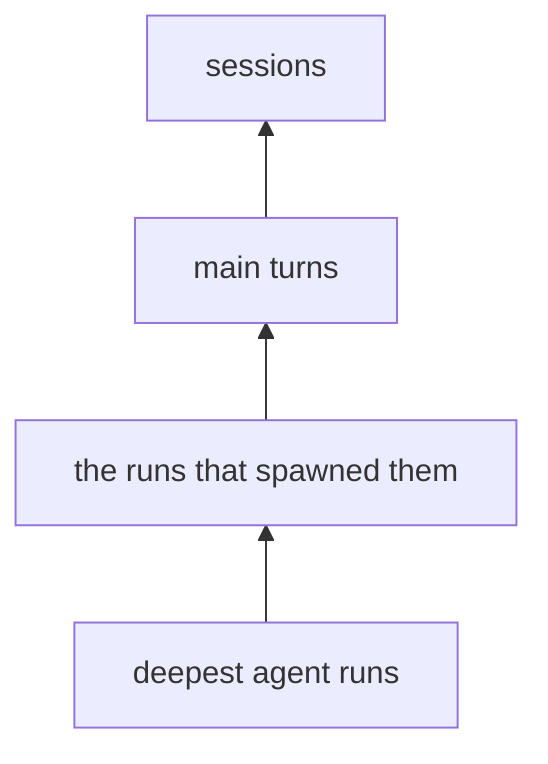

# Enrichment

Enrichment reads the trace store and writes a description of what happened, in the model's words, beside every agent run, main turn, and session. Findings can then filter and group on meaning — "every turn that debugged something and failed" — without re-reading a single transcript.

```bash
uv run aiobserve enrich ~/repos/mycelia --dry-run   # what it would send, and what that costs
uv run aiobserve enrich ~/repos/mycelia             # describe everything stale
```

`--dry-run` spends nothing, calls nothing, and needs no `ANTHROPIC_API_KEY` — a real run refuses to start without one. Every flag lives in `src/aiobserve/cli.py`; `--limit` buys a cheap dev pass, `--no-batch` trades the batch discount for minutes instead of hours.

## What a row holds

One row per described item, in `turn_enrichments`, `agent_run_enrichments`, and `session_enrichments`. Each holds four model-written fields — a description, a `category`, an `outcome`, and a nullable `friction` note. The vocabularies are closed and live in `src/aiobserve/enrich/taxonomy.py`; an answer outside them is refused rather than stored.

Query through the `enriched_turns`, `enriched_agent_runs`, and `enriched_sessions` views, which left-join the descriptions onto the live base rows. A `NULL` description there means "not described yet", and counting them is how you read coverage honestly. `enriched_agent_runs` renames the run's own recorded task to `task_description` and its model to `agent_model`, so `description` means the enrichment's in all three views.

## Descriptions go up, text never does

Every prompt embeds its children's **descriptions**, not their text. A session prompt carries one line per thing the session did; it never carries a transcript. That is the whole reason the corpus is affordable — tool results alone run to hundreds of megabytes — and it is why the levels are described bottom-up:



Agent runs go out in rounds, deepest first, so no parent is ever described from a hole. A run's parent is the agent named in `parent_agent_id` where there is one, and otherwise whatever transcript holds the tool call that spawned it. A session's direct children are its main turns plus **the runs nothing else embeds** — teammates the team mechanism started, and runs spawned by a call belonging to no turn. Nothing may be dropped silently, so that set is derived from the same parent rule the rounds order by rather than from a rule of its own.

A session with no main turn and no agent run is skipped, not enriched: there is nothing to describe. Compaction records and duplicate-uuid sessions are the recorded cases.

## Staleness is the whole resume mechanism

A row is current when four things match: the hash of the rendered prompt, the level's prompt version, the taxonomy version, and the model that answered. Anything else moves, and the row is stale.

The hash covers the **rendered content only**, so a re-extract that changes no text costs nothing. It also makes the cascade fall out for free: a child described in new words changes what its parent renders to, so the parent goes stale in the same invocation. A child re-described in the same words stops there.

That is why a dry run's count is an upper bound. It quotes every stale item plus every item whose prompt embeds one, because no read can tell in advance which descriptions will actually change.

There is no resume state on disk. A failed item writes no row, so it is still stale next time and rerunning is the retry. An item whose child failed writes nothing either — a description built around a hole would be hashed as current forever, which is the one failure a rerun cannot heal.

## What it costs

`src/aiobserve/enrich/cost.py` holds the rate table and the arithmetic: rendered characters over a chars-per-token ratio, plus each level's instructions, at list price halved for the batch path. It counts prompt caching at zero, so it reads high there. A full pass over the mycelia corpus is single-digit dollars on Haiku.

Prices move and models get added. An unpriced model crashes rather than quoting zero.

## Changing a prompt or the taxonomy

Both are re-buys, and both are deliberate:

- Editing a level's instructions means bumping `PROMPT_VERSION[level]` in `src/aiobserve/enrich/prompts.py` — the hash cannot see instructions, so nothing else would notice
- Adding or renaming a taxonomy member means bumping `TAXONOMY_VERSION`, which re-describes every level

A run-level bump cascades upward through every round, so price it with `--dry-run` first.

## Design

The decisions, their alternatives, and the measurements behind them are in `plans/enrichment/design.md`, with the as-built notes recording where the implementation diverged.
