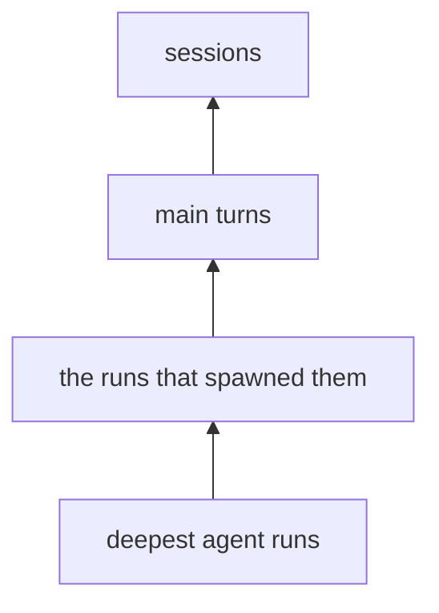

# Enrichment

Enrichment reads the trace store and writes a description of what happened, in the model's words, beside every agent run, main turn, and session. Findings can then filter and group on meaning — "every turn that debugged something and failed" — without re-reading a single transcript.

```bash
uv run aiobserve enrich ~/repos/mycelia --dry-run   # what it would send, and what that costs
uv run aiobserve enrich ~/repos/mycelia             # describe everything stale
```

Enrichment spends the Claude Code subscription. It shells out to `claude -p` once per item, so there is no API key to hold and nothing billed separately — log in with `claude` first. A run that would spend asks `claude auth status` before it renders anything and refuses on a logged-out CLI, a login with no subscription behind it, or no `claude` on `PATH`. `--dry-run` asks nothing, because quoting spends nothing and whoever prices a pass is not always whoever is logged in.

Every flag lives in `src/aiobserve/cli.py`; `--limit` buys a cheap dev pass, and `--concurrency` sets how many `claude` processes a round runs at once, four by default.

## What a row holds

One row per described item, in `turn_enrichments`, `agent_run_enrichments`, and `session_enrichments`. Each holds four model-written fields — a description, a `category`, an `outcome`, and a nullable `friction` note. The vocabularies are closed and live in `src/aiobserve/enrich/taxonomy.py`; an answer outside them is refused rather than stored.

Query through the `enriched_turns`, `enriched_agent_runs`, and `enriched_sessions` views, which left-join the descriptions onto the live base rows. A `NULL` description there means "not described yet", and counting them is how you read coverage honestly. `enriched_agent_runs` renames the run's own recorded task to `task_description` and its model to `agent_model`, so `description` means the enrichment's in all three views.

The query library ships three named questions over these rows, each runnable with `aiobserve query` and citable in a report:

- `enrichment_coverage` — what share of each level is described, split by category, outcome, model and prompt version. The row with no category is the gap
- `enrichment_digest` — one session's descriptions, keyed so they sit beside `session_digest`, `run_digest` and `view_runs`
- `select_enrichments` — a seeded draw of described items, so many per category, for checking descriptions against the records they came from

All three read tables an enrichment pass writes. A store no pass has touched does not hold them, and the query fails saying so.

[The viewer](viewer.md) shows the same rows beside what they describe. It reads the three tables rather than the views — a described item and an undescribed one render differently — and asks whether the tables exist at all, so a store no pass has touched still serves every page.

## Descriptions go up, text never does

Every prompt embeds its children's **descriptions**, not their text. A session prompt carries one line per thing the session did; it never carries a transcript. That is the whole reason the corpus is affordable — tool results alone run to hundreds of megabytes — and it is why the levels are described bottom-up:



Agent runs go out in rounds, deepest first, so no parent is ever described from a hole. A run's parent is the agent named in `parent_agent_id` where there is one, and otherwise whatever transcript holds the tool call that spawned it. A session's direct children are its main turns plus **the runs nothing else embeds** — teammates the team mechanism started, and runs spawned by a call belonging to no turn. Nothing may be dropped silently, so that set is derived from the same parent rule the rounds order by rather than from a rule of its own.

Two kinds of session are skipped rather than enriched, both held by the `describable_sessions` view. One has no main turn and no agent run — there is nothing to describe, and compaction records and duplicate-uuid sessions are the recorded cases. The other holds turns that drove no api call: a `/model` or `/effort` turn the CLI answered by itself, leaving no model response to describe. A QC pass found the enrichment model inventing work for those rather than reporting none, so the fix is not to ask.

A main turn that ran a slash command carries **what the CLI printed** beside the command, capped at 2,000 characters. Where the turn drove no api call it is the only account of what happened, and most such turns carry one — 272 of 280 in the mycelia corpus (2026-08-13). The render distinguishes three states rather than leaving the model to infer one: the output; "the command printed nothing", which every recorded `/clear` is; and "not recorded", for a turn nothing archived an answer for. Claude Code archives that output in either of two record shapes ([schema](schema.md)) — one in a third shape stops the pass rather than reading as an empty answer.

The view is also what `sweep_zombies` measures a session row against, so rows written before the gate are deleted on the next run and `aiobserve enrich` reports the count. Turns are not gated — a turn that drove no api call keeps its row.

## Staleness is the whole resume mechanism

A row is current when four things match: the hash of the rendered prompt, the level's prompt version, the taxonomy version, and the model that answered. Anything else moves, and the row is stale.

The hash covers the **rendered content only**, so a re-extract that changes no text costs nothing. It also makes the cascade fall out for free: a child described in new words changes what its parent renders to, so the parent goes stale in the same invocation. A child re-described in the same words stops there.

That is why a dry run's count is an upper bound. It quotes every stale item plus every item whose prompt embeds one, because no read can tell in advance which descriptions will actually change.

There is no resume state on disk. A failed item writes no row, so it is still stale next time and rerunning is the retry. An item whose child failed writes nothing either — a description built around a hole would be hashed as current forever, which is the one failure a rerun cannot heal.

## How a round runs

One `claude -p` per item, over a thread pool `--concurrency` wide. Each call carries the level's instructions on `--system-prompt`, the rendered content on stdin, and the answer's shape on `--json-schema`. Tools, settings, MCP and slash commands are all off, and the cwd is a temp directory: a render is untrusted transcript text, and nothing it says may reach a tool or leave a session behind in an extractable project.

The subprocess environment is **constructed, not inherited** — `HOME`, `PATH`, `USER`, and `MAX_THINKING_TOKENS=0`, nothing else. `USER` is load-bearing: the OAuth token lives in the keychain, and without it every call reports itself logged out. A stray `ANTHROPIC_API_KEY` or `ANTHROPIC_BASE_URL` cannot divert the run off the subscription, because it never reaches the child. `preflight` asks its auth question under that same environment, so what it validates is the process shape the items spend under.

The round's first item runs alone as a **canary**, and is the only call allowed to crash the run. Everything after it is spending: the enricher writes a round's rows only once `submit` returns, so a raise mid-round would forfeit answers already paid for. Five consecutive failures trip the **breaker** — nothing further starts, the unsent remainder comes back `Failed(aborted)`, the answers already in hand are written, and the run crashes at the end naming both.

**Ctrl-C ends the round, not the answers.** A pass runs for hours and `--limit` is the only pacing lever, so stopping one is expected. The round it lands in waits out the calls already running, writes what it bought, and the run stops at the next round instead of mid-write; press it again and it gives up on the answers still in the air, which come back `aborted` like anything else with no answer to its name.

### The envelope, pinned at claude 2.1.221

`--output-format json` answers with one object, of which this build reads four fields. Everything else the CLI writes is ignored, so a new field is not drift:

- `is_error` and a nonzero exit — the call failed. Retried once, then recorded as `api_error`
- `stop_reason` — `max_tokens` means the answer was cut off at the cap, so it is `invalid_output` rather than a truncated answer worth storing. Every other value is left to `structured_output` to judge
- `modelUsage` — keyed by model id. A key that is not the model asked for means the CLI substituted one, which would make the staleness `model` axis a lie
- `structured_output` — the answer itself. Its **absence is not drift**: the CLI omits it whenever the model produced nothing conforming, as the recorded logged-out envelope shows, so it is `invalid_output`

A missing contract field is drift. On the canary that raises `EnvelopeDrift` for the price of one item, rather than describing thousands against a shape nobody has read; past the canary it is one more per-item failure. Claude Code owns this envelope and changes it without notice — re-record `tests/enrich/fixtures/` when it moves, and say which version did.

## What it costs

`src/aiobserve/enrich/cost.py` holds the rate table and the arithmetic: rendered characters over a chars-per-token ratio, plus each level's instructions, plus a flat per-item transport constant — the CLI's own framing and the `--json-schema` payload, which a fresh subprocess pays for every time. There is one price, list price: the batch discount went with the API. Prompt caching counts as zero, so the quote reads high. A full pass over the mycelia corpus is single-digit dollars on Haiku.

It costs time rather than money. At the ~4s per item measured on 2026-08-13, four at a time, a full corpus pass is over an hour of four `claude` processes against an allowance this project's own agents share. `--limit` is the only pacing lever, and it is manual.

Prices move and models get added. An unpriced model crashes rather than quoting zero.

## Changing a prompt or the taxonomy

Both are re-buys, and both are deliberate:

- Editing a level's instructions means bumping `PROMPT_VERSION[level]` in `src/aiobserve/enrich/prompts.py` — the hash cannot see instructions, so nothing else would notice
- Adding a taxonomy member, renaming one, or changing what one means — the definitions are what the model classifies by — means bumping `TAXONOMY_VERSION`, which re-describes every level

A run-level bump cascades upward through every round, so price it with `--dry-run` first.

## Design

The decisions, their alternatives, and the measurements behind them are in `plans/enrichment/design.md`, with the as-built notes recording where the implementation diverged.
