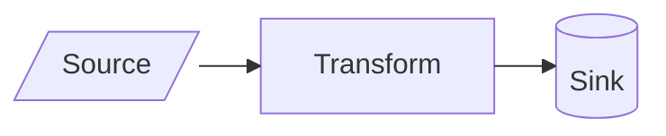
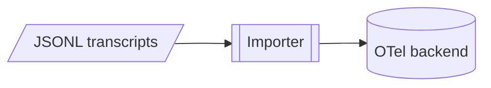

# Mermaid diagrams

Use this guide to write Mermaid diagrams that stay small, render on GitHub, and share one visual language. Prefer `.mmd` for standalone diagrams; use ` ```mermaid ` blocks when a document owns the diagram.

## Make each diagram answer one question

Choose the axis before you draw. Name it in the section heading or, for a standalone file, in the filename.

| Tier | Axis | Question | Mermaid type | Filename tag |
| --- | --- | --- | --- | --- |
| Static | **structure** | What are the parts, and how do they connect? | `flowchart` | `_structure` |
| Static | **schema** | What shape does the data have? | `erDiagram` or `classDiagram` | `_schema` |
| Dynamic | **process** | How does the system act over time? | `sequenceDiagram` or `flowchart` | `_process` |
| Dynamic | **data_flow** | How does data move from source to sink? | `flowchart` | `_data_flow` |
| Dynamic | **lifecycle** | How does one entity change state? | `stateDiagram-v2` | `_lifecycle` |
| Dynamic | **ux** | What does the user see and do? | `journey` or `flowchart` | `_ux` |

Pick only the axes that help the reader. Most subjects need one or two.

Keep one question and one level of detail in each diagram. Split a picture that mixes architecture, control flow, and data movement. If an overview needs more detail, add a drill-down diagram instead of crowding the overview.

A subject's axis diagrams are peers. For example, a pipeline's structure and process views belong in sibling diagrams; neither is a drill-down of the other.

For a process diagram, use a sequence diagram when message order matters. Use a flowchart when branches matter.

## Use the shared visual language

Use these shapes and no others:

| Meaning | Syntax | Shape |
| --- | --- | --- |
| Process or step | `id[Text]` | rectangle |
| Start or end | `id([Text])` | stadium |
| Decision | `id{Text}` | rhombus |
| Datastore | `id[(Text)]` | cylinder |
| Subject with a drill-down diagram | `id[[Text]]` | subroutine |
| Input or output | `id[/Text/]` | parallelogram |

The subroutine shape marks a drill-down. Don't use `[[...]]` unless a deeper diagram exists.

Use classic bracket syntax rather than Mermaid v11.3's `@{shape:}` syntax. The bracket forms work across more renderers, including GitHub.

Use edges consistently:

| Syntax | Meaning |
| --- | --- |
| `-->` | primary or synchronous flow |
| `-.->` | asynchronous, optional, deferred, or feedback flow |
| `==>` | emphasized main path |

Quote every edge label: `source -->|"label with (special) characters"| target`. Label each decision branch, such as `decision -->|"Yes"| next`.

Don't add `classDef`, `style`, or `linkStyle` unless the task calls for styling. Shapes and edges already carry meaning, while custom colors often fail in another theme. If a rendered view needs visual weight, define the choice once where that view is emitted.

## Write syntax that renderers accept

Follow these rules to avoid common parse failures:

- Don't use bare `end` as a node ID or label; write `End` or choose another word
- Put spaces around an edge when the target starts with `o` or `x`; `A---oB` creates a circle edge, while `A --- oB` points to the node `oB`
- Quote node labels that contain special characters: `id["Label (x)"]`
- If quoted punctuation still fails, use HTML entities: `#40;` for `(`, `#41;` for `)`, and `#35;` for `#`
- Use `<br>` for a line break in a label, never `\n`
- Use `-->`, not `->`
- Put `%%` comments on their own lines
- Give nodes short, descriptive snake_case IDs such as `importer` and `span_tree`, never `A`, `B`, or `C`

## Keep the layout small

Declare the direction first. Use `TD` for sequential or decision flows and `LR` for wide trees or pipelines. Declare nodes, then group related parts with `subgraph`.

Split a diagram when it grows past about 20 nodes, eight parallel branches, or 100 edges. Split along the drill-down hierarchy rather than squeezing in more detail.

Dagre is Mermaid's default layout and the layout to design for because GitHub uses it. ELK can untangle a large flowchart in local previews:



GitHub and other renderers may ignore ELK and fall back to dagre. Treat ELK as a local escape hatch, not a requirement for understanding the committed diagram.

## Put detail in drill-down diagrams

A drill-down diagram expands one node from its parent. The parent node uses `[[...]]`, and the child diagram covers that node's subject at the next level of detail.

Put a diagram in the document section that needs it. This keeps the prose and picture together. Use a standalone `.mmd` file only when no single document owns the diagram; name it `<subject>_<axis>.mmd` and keep its drill-down children beside it.



Here, `Importer` promises a deeper diagram. `backend` remains a datastore because it has no drill-down.

Keep the hierarchy shallow. Its purpose is to keep each diagram focused and current, not to create a tree of pictures readers must search.

## Validate, render, and inspect

Run this loop when you need proof that a diagram parses and reads well:

1. Write or edit the `.mmd` file or Mermaid block
2. Run `mise run diagram-check <file>`; a nonzero exit means Mermaid couldn't render the source
3. Run `mise run diagram-render <file>`; the task prints each PNG path and creates one PNG per Mermaid block in a Markdown file
4. Inspect the PNG for overlaps, crossing edges, clipped nodes, unclear labels, and wrong shapes
5. Fix the source and render again

Inspect the PNG rather than the SVG because the raster output exposes layout problems. If the content is sound but the layout is tangled, switch between `TD` and `LR`, group related nodes, or try ELK. Split the diagram when layout changes no longer help.

Both tasks run `npx @mermaid-js/mermaid-cli`, which uses headless Chrome through Puppeteer. If the machine has no system Chrome, set `PUPPETEER_EXECUTABLE_PATH` to a Chrome executable.
