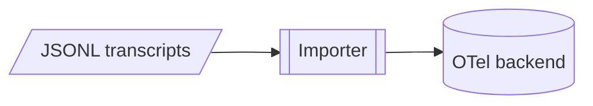

# Mermaid authoring guide

How to author Mermaid diagrams in this repo, whether in `.mmd`/`.mermaid` files (prefer `.mmd`) or ` ```mermaid ` blocks in Markdown.

## Which diagram, and when

A system has several orthogonal axes, and each needs its own diagram. Spanning axes in one picture is the main cause of unreadable hairballs. Name the axis where the diagram appears — in its section or in the filename of a standalone `.mmd` — so the question it answers is explicit.

| Tier | Axis | Question it answers | Mermaid | Tag |
|---|---|---|---|---|
| Static | **structure** | What are the parts and how do they connect? | `flowchart` (architecture / context) | `_structure` |
| Static | **schema** | What is the shape of the data? | `erDiagram` / `classDiagram` | `_schema` |
| Dynamic | **process** | How does the system act over time (control flow)? | `sequenceDiagram` or `flowchart` | `_process` |
| Dynamic | **data_flow** | How does data move (source → transform → sink)? | `flowchart` (DFD) | `_data_flow` |
| Dynamic | **lifecycle** | How does one entity change state? | `stateDiagram-v2` | `_lifecycle` |
| Dynamic | **ux** | What does the user see and do? | `journey` or `flowchart` | `_ux` |

Treat the table as a vocabulary to pick from, not a checklist. Most subjects need one or two axes, never all six.

Three rules keep diagrams legible:

1. **One question per diagram.** A flowchart that shows structure *and* process *and* data at once is three diagrams in a trenchcoat — split it.
2. **One level of abstraction per diagram.** Don't mix a top-level "system and its dependencies" view with low-level calls. Zoom in with a sub-diagram (see *Drill-down*), never by adding detail to the overview.
3. **One subject's axes are peers, not a hierarchy.** A subject can warrant several axis diagrams — an import pipeline has both a `_structure` and a `_process` view. Those are *sibling files*, not drill-downs of each other, so never navigate between them with a `[[...]]` node.

For the process axis, choose by what the diagram is *about*: a **sequence diagram** when the point is who talks to whom in what order, a **flowchart** when the point is branching logic. Don't force branching into a sequence diagram or message-ordering into a flowchart.

## Shape vocabulary

Use only these shapes and meanings so the vocabulary stays consistent:

| Meaning | Syntax | Renders as |
|---|---|---|
| Process / step | `id[Text]` | rectangle |
| Start / end | `id([Text])` | stadium |
| Decision | `id{Text}` | rhombus |
| Datastore / DB | `id[(Text)]` | cylinder |
| Sub-process with its own diagram | `id[[Text]]` | subroutine |
| I/O | `id[/Text/]` | parallelogram |

`[[...]]` is **reserved for drill-down** in this repo (see below) — never use it for a node that has no sub-diagram.

Use classic bracket shapes (not the v11.3 `@{shape:}` syntax) so diagrams render on GitHub and everywhere else.

## Edge conventions

- `-->` solid — primary/sync flow
- `-.->` dotted — async / optional / deferred / feedback
- `==>` thick — emphasized main path
- **Quote every edge label:** `source -->|"label with (special) characters"| target`. Punctuation like `(`, `)`, `:` or `/` otherwise trips the parser.
- **Label every decision branch:** `decision -->|"Yes"| next`.

## Styling

**Don't style a diagram unless you were asked to.** No `classDef`, `style` or `linkStyle` by default. The shape and edge vocabularies above already carry the meaning, so added color becomes a second, private vocabulary the next reader has to learn. A hand-picked color that reads well on one theme can vanish on another.

Where a rendered diagram needs visual weight, make the choice once and document it where it is emitted, not per diagram.

## Syntax pitfalls

These break AI-generated diagrams the most:

- **`end` is reserved.** A bare `end` node/label can break the parse — capitalize (`End`) or rephrase.
- **Leg `o`/`x` glues onto the target.** `A---oB` becomes a *circle-edge* to `B`; write `A --- oB` or rename the node so an edge never abuts a leading `o`/`x`.
- **Quote labels with special characters:** `id["Label (x)"]`. For characters that still trip the parser inside quotes, use HTML entities: `#40;` `(`, `#41;` `)`, `#35;` `#`.
- **Newlines in labels:** `<br>`, never `\n`.
- Use `-->`, not `->`. Comments are `%%` on their own line. Node IDs are short, descriptive and snake_case (`importer`, `span_tree`) — never `A`/`B`/`C`.

## Layout & quality budgets

- **Declare direction first:** `TD` for sequential/decision flows, `LR` for wide trees/pipelines.
- **Declare nodes, then group** related ones with `subgraph`.
- **Budgets — split when exceeded:** ≤ ~20 nodes, ≤ 8 parallel branches, ≤ 100 edges per diagram. Past the budget, split along the drill-down hierarchy rather than adding detail. Mermaid hard-fails past 280 edges.

A diagram approaching its budget is telling you to split it. Many small, single-purpose diagrams beat one large one.

## dagre vs ELK

**dagre** is the default renderer and the one GitHub uses, so author for it. **ELK** lays out large, tangled flowcharts better; opt in through front-matter:

```mermaid
---
config:
  layout: elk
---
flowchart LR
```

But GitHub and many renderers **ignore ELK and fall back to dagre**, so your local preview can differ from what GitHub shows. Use ELK only as a *local* escape hatch for a tangled diagram; never rely on it for the committed view.

## Drill-down: keep each diagram small

Detail lives in separate diagrams arranged as a zoomable hierarchy: **a node in a level-N diagram is the entire subject of a level-(N+1) diagram.** Think maps at increasing zoom, never one infinite diagram.

- **Subroutine shape = drill-down marker.** A node with its own sub-diagram uses `[[Label]]`. That is the only meaning of `[[...]]` here — the visual cue that says "look deeper."
- **A diagram lives in the document it serves**, as a ` ```mermaid ` block in the section that raises the question. The reader meets the picture where the prose needs it, and doc sync updates both at once. A standalone `.mmd` file is for a diagram no single document owns; name it `<subject>_<axis>.mmd` and keep its drill-down children beside it.
- **A subject's axes are peers, not a hierarchy.** An import pipeline can have both a `_structure` and a `_process` view. Those are sibling files, not drill-downs of each other — never navigate between them with a `[[...]]` node.



`backend` is a plain datastore, not a drill-down, so it stays `[(...)]`. `[[Importer]]` says a deeper diagram exists for it.

Keep sub-diagrams few and tightly scoped. The hierarchy exists so each diagram stays small and current, not as an excuse for a deep tree of stale pictures.

## The render/validate loop

Not every edit needs this. When you want proof a diagram is valid and lays out well:

1. Write or edit the `.mmd` file or ` ```mermaid ` block.
2. **Validate:** `mise run diagram-check <file>` — mmdc validates by rendering, so a non-zero exit is a syntax error to fix.
3. **Render for inspection:** `mise run diagram-render <file>` — prints the path of every PNG it wrote, one per ` ```mermaid ` block in a Markdown file. Inspect the raster PNG, not SVG, for layout.
4. **View the PNG** and check for overlapping nodes, crossing edges, clipped nodes, unreadable labels, wrong shapes. Fix the *source*. If the layout, rather than the content, is tangled, flip `TD`↔`LR`, add subgraphs, or try ELK; past ~20 nodes, split.
5. Re-render until clean.

Both tasks shell out to `npx @mermaid-js/mermaid-cli`, which drives a headless Chrome through Puppeteer. On a machine without a system Chrome, set `PUPPETEER_EXECUTABLE_PATH` to the path of one.
