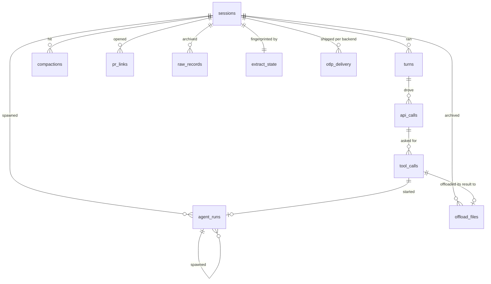

# The trace store

`aiobserve extract` writes session traces into one DuckDB file. There is one canonical store, `data/traces.duckdb` — gitignored, like everything under `data/`. Read this before you delete a store, move one, or bump a version constant.

## What it holds



The columns live in `_SCHEMA` in `src/aiobserve/export/duckdb.py`, and what each telemetry field means, with the session that proves it, in [the schema guide](schema.md). A session's own thread and each of its agent runs share these tables and are told apart by `source`, so a turn or a call is keyed by `(session_id, source, id)`.

Nothing here is queried raw. `_VIEWS` in the same module derives the `live_*` views, which drop the records a fork replayed, and the `corpus_*` views, which additionally drop the records an earlier session already holds — a resume copies its ancestor's records verbatim, so counting both doubles the corpus. `session_rollups` and `corpus_rollups` roll each family up to one row per session.

[Enrichment](enrichment.md) writes into the same file: three `*_enrichments` tables keyed one-to-one onto sessions, turns and agent runs, plus the views that join them back on. A store no pass has touched holds none of them, which is why a query over them fails saying so.

## The store is the archive, not a cache

Claude Code prunes a session's transcript and its `tool-results/` files from disk after a few weeks, which is the constraint the pipeline was built around ([the trace-pipeline design](../plans/trace-pipeline/design.md)). Every line of every file goes into the store — `raw_records` holds the transcripts, `offload_files` the tool outputs Claude Code moved out of them — so once a session's files are gone, the store is the only copy of it. A refresh keeps such a session's rows rather than mirroring what is on disk.

Deleting a store therefore destroys sessions no re-extract can recover. Re-parsing a pruned session out of its archived `raw_records` is possible but not built; the design lists it under out of scope.

## A version bump re-extracts in place

`EXTRACTOR_VERSION` (`src/aiobserve/extract/claude_code.py`) is folded into each session's fingerprint, so raising it makes the next refresh re-extract every session whose files are still on disk, into the same store. Nothing needs deleting, and pruned sessions keep whatever the parser of their day produced.

`SCHEMA_VERSION` (`src/aiobserve/export/duckdb.py`) has no migrations while the project is early. Opening a store an older schema wrote refuses before it reads or writes a single table, and says to extract into a fresh one. Deleting the old store is a separate decision — run the check below first.

A fresh store also starts with an empty `otlp_delivery`, the table `export-otlp` writes to record what a backend confirmed. The next export therefore re-sends every session to every backend ([the OTLP export guide](otlp-export.md)).

## Check the session set before deleting a store

An older store is safe to delete once the canonical store holds every session it holds:

```sql
ATTACH 'data/traces.duckdb' AS canonical (READ_ONLY);
ATTACH 'old.duckdb'        AS old       (READ_ONLY);
SELECT id FROM old.sessions EXCEPT SELECT id FROM canonical.sessions;
```

No rows means every session in the old store was re-extracted into the canonical one. A row is a session the canonical store has never heard of — usually one whose files Claude Code has since pruned, which makes the old store its only home.

The check compares session ids, not rows. It answers "would deleting this lose a session?", which is the question after a re-extract from the same files.
