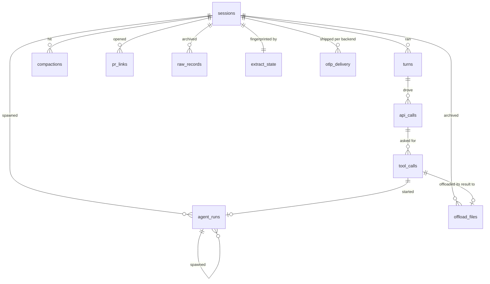

# The trace store

The trace store is one DuckDB file, `data/traces.duckdb`: the archive `aiobserve extract` writes to and every query reads. It is gitignored with the rest of `data/`. Treat it as an archive — read this guide before deleting it, moving it, or changing a version constant.

## The store holds traces and derived data



`_SCHEMA` in `src/aiobserve/export/duckdb.py` defines the trace tables and their columns. The OTLP exporter defines its own `otlp_delivery` table in `src/aiobserve/export/otlp_delivery.py`. Other components that write to the store also own their tables, including the enrichment tables described below. [The schema guide](schema.md) defines each telemetry field and cites the recording that proves it.

A session's main thread and agent runs use the same trace tables. The `source` column distinguishes them, so `(session_id, source, id)` identifies a turn or call.

Queries use views instead of reading the trace tables directly. `_VIEWS` in `src/aiobserve/export/duckdb.py` defines `live_*` views, which omit records replayed by a fork. The `corpus_*` views also omit records already stored for an earlier session. Resumed sessions copy their ancestor's records, so counting both would count the same records twice. `session_rollups` and `corpus_rollups` reduce each family to one row per session.

[Enrichment](enrichment.md) adds three `*_enrichments` tables keyed one-to-one to sessions, turns, and agent runs. It also adds views that join the enrichments to those records. Until an enrichment pass writes these tables, queries against them fail with an error that says they don't exist.

## The store is the only durable archive

Claude Code deletes session transcripts and their `tool-results/` files from disk after a few weeks. This constraint shaped [the trace-pipeline design](../plans/trace-pipeline/design.md). The extractor archives every line: `raw_records` holds transcripts, while `offload_files` holds tool outputs that Claude Code moved out of them. A refresh keeps rows for sessions whose source files are gone instead of making the store mirror the disk.

Nothing is redacted on the way in, and nothing is redacted for now. Every prompt, model output, tool result, and file an agent read stays intact in the store and reachable in [the viewer](viewer.md). Fixtures committed to this repository are the opposite case: they stay redacted excerpts (`.claude/rules/testing.md`).

Once Claude Code deletes those files, the store holds the only copy. Deleting it can destroy sessions that extraction can't recover. The archived `raw_records` contain enough data to reparse a pruned session, but that feature isn't built; the design lists it as out of scope.

## Choose the right path for each version change

Each session fingerprint includes `EXTRACTOR_VERSION` from `src/aiobserve/extract/claude_code.py`. Raising that version makes the next refresh re-extract every session whose files remain on disk. Extraction updates the existing store, so you don't need to delete it. Pruned sessions keep the rows produced by the parser that first extracted them.

`SCHEMA_VERSION` in `src/aiobserve/export/duckdb.py` has no migrations while the project is early. The program refuses to read or write a store created with another schema version. It tells you to extract into a fresh store instead. Don't delete the old store until you run the check below.

A fresh store has an empty `otlp_delivery` table. Because `export-otlp` uses that table to track what each backend confirmed, the next export sends every session to every backend again. See [the OTLP export guide](otlp-export.md).

## Compare session IDs before deleting an old store

You can delete an old store after the canonical store contains every session ID found in it:

```sql
ATTACH 'data/traces.duckdb' AS canonical (READ_ONLY);
ATTACH 'old.duckdb'        AS old       (READ_ONLY);
SELECT id FROM old.sessions EXCEPT SELECT id FROM canonical.sessions;
```

No rows means the canonical store contains every session from the old store. A returned ID marks a session that the canonical store has never seen. Its source files may have been pruned, leaving the old store as its only copy.

This query compares session IDs, not table rows. It answers one question: would deleting the old store lose an entire session after re-extracting the same source files?
