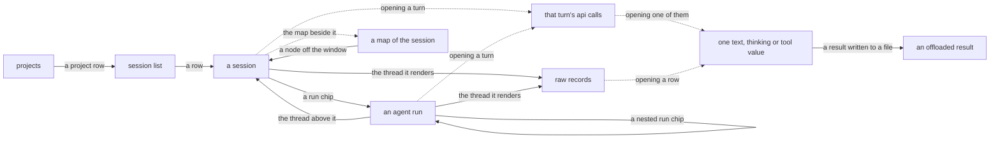

# The trace viewer

`aiobserve view` opens the trace store in a local browser. Use it to move from a corpus-level session row to turns, agent runs, and raw records, then copy stable URLs into reports.

The server binds only to `127.0.0.1`, opens the store read-only, and serves only vendored assets. Run `aiobserve view --help` for flags. See [the trace-viewer design](../plans/trace-viewer/design.md) for the choices behind the implementation.

## Follow a session down to its source records



Solid edges lead to pages with their own URLs, and the map beside a session page is a fragment with one:

| Page | Route |
| --- | --- |
| Projects | `/` |
| Session list | `/sessions` |
| Session | `/session/{session_id}` |
| Agent run | `/session/{session_id}/run/{run_id}` |
| Raw records | `/session/{session_id}/records/{source}` |
| Offloaded result | `/session/{session_id}/offload/{name}` |
| Session map | `/fragment/nav/{session_id}` |

Dotted edges fetch a fragment into the open page. Each request returns one value or one bounded page of rows. `src/aiobserve/view/app.py` declares every route.

## The landing page counts projects

`/` lists every project the store holds sessions for, most recently active first, with sessions and spend over the last 7 days, the last 30, and all time. A row opens the session list filtered to that project. Sessions recorded from a checkout's worktrees count under the checkout, and sessions with no recorded directory gather into an unlinked `(no project)` row. The footer cites the query and `as_of`, the date both windows were measured back from, so the page reproduces tomorrow.

## The session list keeps the query visible

The list has one row per session. A row shows how long ago the session started over its timestamp, its title and project, rollup counts, its tool errors as a rate over the count, cost over output tokens, wall time over active time, the agent types it spawned with a count of each, and its skills. A column showing two values is one cell read as two lines: the value the column is scanned for, and the texture under it. Over a store an enrichment pass has run against, a Work column says what kinds of turn the pass found. Every column heading sorts by that column; click it again to reverse the order. Sessions the store has no value for sort last either way — a session it knows nothing about is neither the newest nor the oldest. Errors sorts by the count rather than the rate: one failure in one call is 100% and not the session someone ranking by errors is looking for. A `*` after the cost means the session called a model missing from the price table, so the shown total is a floor. A project directory under the home of whoever is reading prints with `~` in its place, on this page and on the landing page and the session header; the link, the filter and the suggestion box still carry the path the store holds, because that is what a filter matches.

Rows show only the head of long text: 100 characters for the title and project path, four skill names and four agent types followed by the number omitted, and three kinds of work. The session header shows five skill names of up to 60 characters along with its other fields; it too stays bounded.

The form above the list filters by project, date range, skill, or a minimum number of failed tool calls. The project filter matches a path prefix, the same rule as the CLI's `--project`: filtering by a checkout keeps the sessions its worktrees recorded.

Filters survive sorting and paging. The `clear` link beside the form drops them. The footer prints a citation after paging and names every active filter, so it describes the rows on screen.

## Session pages account for every call and run

A session page starts with the stored session header — what the session was, when it ran, how much it did, and what it cost, in four clusters — then pages through the main-source turns in order. Each turn shows its prompt or command, counts, and cost. A turn that ran a slash command leads with the command's name as a badge, then the arguments typed after it, rather than the wrapper Claude Code records around them. A run spawned from that turn appears as a chip, with descendant runs nested beneath it.

Two extra groups make the timeline totals match the header. The unattributed row holds calls that belong to no turn. The unattached section holds runs that resolve to neither a turn nor another run in the session.

Every growing list has a cap: turns, run chips, compaction markers, skills, and PR links. Each capped list says how many items it omitted and links to the page that contains them when such a page exists.

A run chip opens `/session/{session_id}/run/{run_id}`. The run page uses the same shape: a run header, a trail of links to the thread above it, its turn timeline, and child runs that no turn claims. The trail stops when the store stops naming parents. A fork's spawning call may live in files the store does not hold, and the viewer will not invent a breadcrumb.

## The map says where you are and what a node cost

Beside the timeline, the map draws the session as one line per node: every main-thread turn, with the runs under it nested and folded shut. A node carries a label head, its cost, and a bar along its bottom edge whose length is the node's share of what the session spent — the one number the viewer spends color on. The bar is logarithmic over three orders of magnitude, from a thousandth of the session to all of it: spend inside a session runs over magnitudes, and a linear scale drew most of a long session's turns with the same shortest bar. Nodes in the window the page rendered read at full strength; the rest recede and link to the page that holds them.

The map takes `after` and `turns` from the page so it knows which nodes are on screen, and `nodes` lowers how many it draws. A node is a turn or a run counted flat, so a cut map says "+N more node(s)". The map arrives one request after the page, and its citations swap into a slot the page leaves in its own footer, so one footer names every query behind what is on screen. The sidebar is a `<details>` that starts open at every width: the viewer ships no script of its own, and a stylesheet cannot close a `<details>` at one width and open it at another. Below 900px it folds above the page, where a reader can collapse it.

## Open large values only when you need them

Opening a turn fetches its api calls one page at a time. Each call shows its model, tokens, cost, an output preview, and a bounded page of its tool calls. Full text, thinking, and one tool call's arguments and result each load through a separate request when opened.

Every timeline links to the raw transcript for its thread. The records page shows each archived line's number, type, length, and head. Opening a row fetches the full line. Each rendered turn also links back to its source line, so you can move between the modeled turn and the archived record in one click.

When Claude Code writes a tool result to a file instead of the transcript, the result links to `/session/{session_id}/offload/{name}`. Some offloads are tens of megabytes, so the page serves them in chunks and returns the next offset. The route treats `name` as a key into `offload_files`; it never opens a path from the URL.

## Enrichment appears beside the recorded trace

After [an enrichment pass](enrichment.md), the viewer places its output beside the stored telemetry. The session header shows the description, category, outcome, and one line of friction. Timeline turns show their description and two tags. Run chips show the tags; the run description appears on the run page. Agent-run turns do not get separate descriptions because the pass describes the run as a whole.

The session list adds each session's one-line description and two tags, cutting the line to the same 100-character head as the title. It does not show `stale` because the list joins the words written by a pass without loading the versions needed to judge them. Session, turn, and run pages can show `stale`: it means the pass used an older prompt or taxonomy version, so rerun the pass. It does not mean the saved description is false.

A store that has never been enriched has none of the enrichment tables. The viewer then shows no enrichment fields. An item that the current pass has not reached looks the same.

## URLs preserve the query behind what you saw

Every page is a plain GET that you can paste into a report or message. The session list accepts `sort`, `direction`, `page`, `size`, and its filter keys. A session page accepts `after`, `turns`, and `chips`; its map accepts `after`, `turns`, and `nodes`. Session and run pages use their ids. The viewer returns 400 for an unknown key, an unknown sort or direction, a filter value of the wrong type, or a page outside its bounds rather than guessing. Sort keys map to fixed columns, filter keys map to fixed predicates, and request values reach SQL only as bound parameters.

Reports cite raw records as `(session_id, source, line_no)`. The records URL derives from that natural key, so a later port or route change does not invalidate the saved tuple. This form opens the records browser on the cited line:

```text
/session/{session_id}/records/{source}?after={line_no - 1}#L{line_no}
```

Turn links use the same cursor pattern. On a session page, `after` means the last turn index already shown, while `turns` and `chips` set the page shape. This form opens with the cited turn first:

```text
/session/{session_id}?after={turn_index - 1}#turn-{turn_id}
```

Timeline paging moves forward by turn index, not row count. A saved link therefore opens the same turns if the session later grows.

## Extracts and page loads can contend for the store

The viewer closes its database connection after each request, leaving `aiobserve extract` free to take DuckDB's write lock while the viewer is idle. Neither side retries a collision:

- If an extract starts while a page request holds the store, the extract fails with DuckDB's lock error. Reload the page, then run the extract again
- If a page loads while an extract holds the lock, the viewer returns 503 and says the store is being written. Reload after the writer releases the lock
- If a re-extract changes the schema while the viewer runs, the viewer returns 503 with the schema version this build expects. Restart the viewer

The viewer fails at startup if the store is missing, its schema is unsupported, or the port is already in use.

## Hard bounds keep every page below 500 KB

A browser can hang if the viewer renders a whole transcript. The viewer therefore bounds the row counts and text behind pages at the SQL boundary. Those queries do not select an uncut column that can hold agent or user content: `raw`, `text`, `thinking`, `result`, `input`, `content`, `agent_type`, `model`, or `description`. `tests/view/test_bounds.py` enforces that rule.

Full-value requests are the declared exception. Each returns one transcript line, text block, thinking block, or tool value, so its size depends on the largest matching value rather than a page of them. Offloads remain chunked. JSON is re-indented only while doing so remains cheap; deeply nested data stays as stored because indentation work grows quadratically with nesting.

`src/aiobserve/view/bounds.py` defines each page size beside its ceiling. Query-bound sizes keep their defaults in the query manifest. A typed size above its ceiling returns 400. The payload checks charge each transcript character at five bytes, the longest HTML escape, and add measured markup costs from the canonical store.

| Surface | Default and limit |
| --- | --- |
| Session list | 104 sessions; each long string is cut to 100 characters, skills and agent types to four 20-character names, and work to three |
| Projects | 100 projects; the path is cut to 100 characters |
| Session timeline | 20 turns and 8 run chips per list by default; at most 100 chips in one list |
| Turn details | 10 api calls, each with at most 12 tool rows; `?calls=` can only reduce the default |
| Raw records | 100 rows by default, at most 200 |
| Offload | 50,000 characters by default, at most 60,000 |
| Session map | 200 nodes, each label cut to 48 characters |
| Compaction markers | 20 per timeline page |

Timeline sizes multiply. The unattached list also appears on every page, so the route requires `(turns + 1) × chips ≤ 200`. A capped run list links to `?turns=1&chips=100`, which can show the widest forest recorded in the canonical store: 94 runs beneath one turn. The largest legal shape is `?turns=19&chips=10`, which projects to 489 KB: 360 KB for run rows, 102 KB for turn rows, 12 KB for compaction markers, and 15 KB for the rest of the page. That leaves no room for a map, which is why the map is a response of its own: 200 nodes project to 170 KB.

Enrichment raised the page ceiling from 350 KB to 500 KB. A described run row costs about half again as much as a bare row, and the widest page can hold 200 of them. Reducing the run budget would have hidden part of the recorded 94-run forest behind a count with no page able to show it, so the ceiling rose instead. Run chips show tags but leave the description for the run page.

The session list is also bound independently of corpus size. Its filter box offers the 10 busiest project paths that fit its bound, whole or not at all; a cut path would filter by a directory nobody named. The projects page cuts a long path the same way and leaves that row unlinked. The same rule keeps row filtering correct: the viewer filters whole titles, paths, and skill lists, then cuts only the rows it renders. The worst-case list projects to 499 KB: 10 KB of page chrome plus 104 rows at 4.7 KB each.

A session header does not have a reader-controlled size, so its query cuts every string, skill list, PR list, session description, and friction line. Compaction markers are capped at 20, just above the 18 in the densest recorded thread. `tests/view/test_bounds.py` measures these fixed costs and checks every legal page shape against the 500 KB ceiling.
