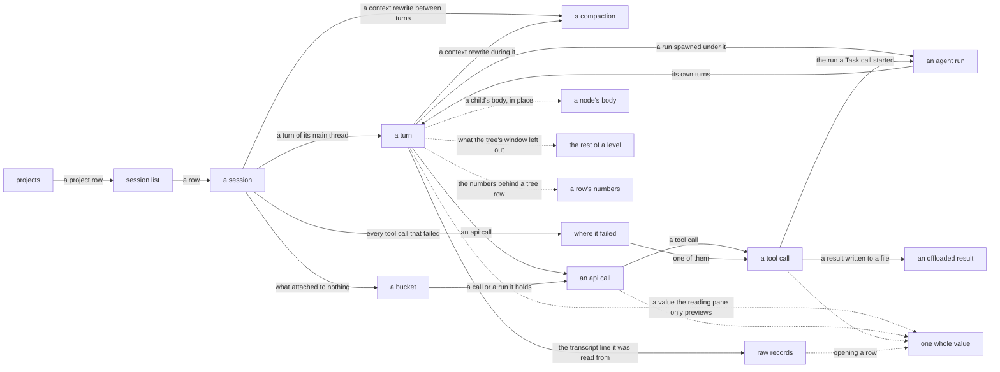

# The trace viewer

`aiobserve view` opens the trace store in a local browser. Everything a session recorded is a node with a page of its own — the session, its turns, the runs it spawned, the api calls, the tool calls, the compactions between them — and you read one node at a time, with a tree beside it showing where that node sits. Copy the URL of anything you want to cite.

The server binds only to `127.0.0.1`, opens the store read-only, and serves only vendored assets. Run `aiobserve view --help` for flags. [The node-browser design](../plans/viewer-node-browser/design.md) holds the choices behind the tree, and [the trace-viewer design](../plans/trace-viewer/design.md) the ones behind the pages around it. Editing a template is governed by `.claude/rules/viewer-ui.md`, and [the UI development loop](ui-development.md) is how to edit one and watch the page: `--dev` reloads the open page on save, and `mise run gallery` serves the scenarios the tests pin.

## Follow a session down to any record it holds



Solid edges lead to pages with their own URLs. Dotted edges fetch a fragment into the open page.

<!-- aigarden:cog sh "uv run python -m tools.gen_routes" -->
| Page | Route | Description |
| --- | --- | --- |
| Projects page | `/` | Every project the store holds sessions for, most recently active first |
| Session list | `/sessions` | One page of sessions, under the filter, sort and size the URL carries |
| A session | `/session/{session_id}` | A session's own node: what it was, and its main thread as the tree's first level |
| A turn | `/session/{session_id}/thread/{source}/turn/{turn_id}` | One turn: what it was asked, and the api calls that answered it |
| An agent run | `/session/{session_id}/run/{run_id}` | One agent run: the brief it was given, and its own thread of turns |
| An api call | `/session/{session_id}/thread/{source}/call/{api_call_id}` | One api call: what it answered, what it thought, and the tools it called |
| A tool call | `/session/{session_id}/thread/{source}/tool/{tool_call_id}` | One tool call: what it was passed, and what it returned |
| A compaction | `/session/{session_id}/thread/{source}/compaction/{compaction_id}` | One compaction: where a thread's context was rewritten, and what that cost it |
| Unattributed calls | `/session/{session_id}/thread/{source}/unattributed` | One thread's api calls that answer no turn — a resume's calls answer turns that live in the session it resumed, and this is where they are read |
| Unattached runs | `/session/{session_id}/unattached` | The session's agent runs no spawning call resolved |
| Errors page | `/session/{session_id}/errors` | Every failed tool call of one session, in the order they happened |
| Query page | `/query/{query_name}` | One library query's SQL, under the bindings a page cited it with |
| Records page | `/session/{session_id}/thread/{source}/records` | One page of a thread's raw transcript — where a report's citation lands |
| An offload file | `/session/{session_id}/offload/{offload_name:path}` | One chunk of a tool result Claude Code wrote to a file beside the transcript |
<!-- aigarden:end -->

`src/aiobserve/view/app.py` declares every route, fragments included. Nothing renders in the reading pane that a cold GET of its own URL doesn't render whole, tree and all.

## The landing page counts projects

`/` lists the projects the store holds sessions for, most recently active first, with sessions and spend over the last 7 days, the last 30, and all time. The page is [bounded](#hard-bounds-cap-every-page-most-at-500-kb) like every other, so a store holding more projects than it shows ends with the number it left out. A row opens the session list filtered to that project. Sessions recorded from a checkout's worktrees count under the checkout, and sessions with no recorded directory gather into an unlinked `(no project)` row. The footer cites the query and `as_of`, the date both windows were measured back from, so the page reproduces tomorrow.

## The session list keeps the query visible

The list has one row per session. A row shows how long ago the session started over its timestamp, its title and project, rollup counts, its tool errors as a rate over the count, cost over output tokens, wall time over active time, the agent types it spawned with a count of each, and its skills. A column showing two values is one cell read as two lines: the value the column is scanned for, and the texture under it. Over a store an enrichment pass has run against, a Work column says what kinds of turn the pass found. Every column heading sorts by that column; click it again to reverse the order. Sessions the store has no value for sort last either way — a session it knows nothing about is neither the newest nor the oldest. Errors sorts by the count rather than the rate: one failure in one call is 100% and not the session someone ranking by errors is looking for. A `*` after the cost means the session called a model missing from the price table, so the shown total is a floor. A project directory under the home of whoever is reading prints with `~` in its place, on this page and on the landing page and the session header; the link, the filter and the suggestion box still carry the path the store holds, because that is what a filter matches.

Rows show only the head of long text: 100 characters for the title and project path, four skill names and four agent types followed by the number omitted, and three kinds of work. Each of those heads ends in an ellipsis where the value went on — the kinds of work are the exception, because that vocabulary is closed and no member of it reaches the width it is cut at. The session header shows five skill names of up to 60 characters along with its other fields; it too stays bounded. A name or PR URL longer than that ends in an ellipsis, and a PR URL the page had to cut is printed rather than linked: half a URL points somewhere else.

The form above the list filters by project, date range, skill, or a minimum number of failed tool calls. The project filter matches a path prefix, the same rule as the CLI's `--project`: filtering by a checkout keeps the sessions its worktrees recorded.

Filters survive sorting and paging. The `clear` link beside the form drops them. The footer prints a citation after paging and names every active filter, so it describes the rows on screen.

## The tree opens one path and nothing else

Beside every node page is the session's tree, with one path open: the selection, its ancestors, each ancestor's children, and the selection's own children. Clicking a row selects it, which opens that row's path and closes the one you left. There are no independent twisties and no way to open two branches at once, so no session makes the tree wider than one open path. Its depth is a hard limit rather than a cap: an open path runs at most 16 levels, and a node deeper than that fails instead of serving a page the byte arithmetic never priced. The deepest chain the recorded corpus holds is 14 — a tool call inside a run five spawns down — so the margin is one more spawn level.

A session's children are the main thread's turns, the compactions that happened between two of them, its calls that answer no turn, and the runs nothing placed. A turn's children are its api calls and the compactions that happened while it ran, in the order they happened; an api call's are its tool calls. An agent run reads like a session: its children are its own turns. A run renders under the *turn* it belongs to, right after the api call that spawned it — the run is the turn's child, not the call's, and a `Task` tool call keeps its own slot with a link to the run at the head of its page.

Above the rows are the presets: **full**, **no api calls**, **agents only**, with the one in force marked. Each is the node you are reading under a different tree, so a switch keeps your place and your knobs — the preset is [`?nav=`](#urls-preserve-the-query-behind-what-you-saw), and the control is the only link on the page that changes it.

Every row with spend badges it: the dollar value sits on a warm ground that deepens with the row's share of what the session cost, logarithmic over three orders of magnitude, because a session's cheapest turn and its dearest are that far apart and a linear scale would paint all but the dearest alike. Tool calls show no cost and wear no badge; what a tool call took is the api call's.

Under every row that ends on a model's context window is the bar: a track the row's width, filled to how full the window was when the node finished, with what the node itself put there left bright at the tip. The scale is linear against the window the model answers in — half a bar is half a window — because what the bar says is fullness against a limit. A turn's tip is what it added over the turn before it, a run's is its whole fill because a subagent starts on an empty window, and a session reads fullness with no tip at all. The fill is read off the last call that answered: an interrupt reports no tokens ([the schema guide](schema.md)), and reading one as the end of the window would say the session ended empty. A model the window table holds no number for draws no bar rather than a bar against a guessed scale, and so a `[1m]` session — the suffix rides the request, not the answer — draws against the standard window and reaches the end of it early. Twentieths are the steps, so a node that added less than one rounds to no tip. Tool calls, compactions and buckets draw no bar; what a tool call took is its api call's.

A level opens on 200 children, and a `+N more` row says how many it left out. Clicking it fetches the rest of that level and stands the rows in its own place, so a wide branch opens where it is rather than sending you to another page. The row the open path descends through is always kept, inside the window. Nothing bounds what that click can bring back: a branch of ten thousand children answers with the ten thousand less the two hundred already on the page.

A tool call that came back an error carries an `error` mark on its row, in the same red the children log and the list use.

## Pointing at a row prints its numbers

Point at a tree row, or tab to it, and the numbers behind its badge and its bar appear beside the tree. A row fetches them once: 200 ms after the pointer arrives, or the moment focus lands anywhere inside it, so a keyboard reaches what a pointer reaches. There is nothing to pin. The popover belongs to the row, so it stays open while the pointer is inside it, and a click into it holds it open while you drag across a number and copy it.

A node made of api calls — a session, a turn, an agent run, a call — shows what its calls read from cache, took as new input and wrote as output; how full the window was when it ended, and the window that fullness was measured against; what it added over the node before it, signed, so a turn after a compaction reads as the negative it is; and the model that answered last. A window the table holds no number for reads `unknown` rather than scaling the counts to a guess. Under those is where the dollars went — input, cache read, cache write, output — then the total and how many api calls it covers. The four are the stored total taken apart at the price table the extract charged each call at, so the legend cannot disagree with the badge above it. Where some of those calls ran on a model the table lacks, the line says how many, and the total is a floor.

A tool call has none of that, because its tokens are its api call's. Its popover shows how much it was asked and how much it gave back, the file its output was offloaded to when there is one, and the other tool calls the same api call asked for in the same breath — the parallel work a row alone cannot show. Compactions and the two buckets have no popover: a bucket is a place rather than a node, and a compaction's own record is its page.

## Jump straight to where a session failed

The tree opens one path, so a failure five spawns down a run tree is behind everything in front of it. `/session/{session_id}/errors` is the way past that: every `is_error` tool call the session made, on every thread, in the order they happened, each row a link to that call's own page. Every node page of a session that failed something carries the count and the way in, under the walk controls.

Standing on a failed tool call, the same block gains a step to the failure before it and the one after — across threads, because the list is the session's rather than one thread's. No other page runs the query: a reading pane on anything else has no step to offer.

The list is bounded like the landing page rather than paged: it shows the first 100 failures in that order and says how many it left. The stepper reads the same capped list, so a failure past the cap is one neither surface reaches. A session that failed nothing has no page here — the URL is a 404, worded apart from a session the store never held.

## The reading pane reads one node

The reading pane leads with the crumb chain down to the node, then the node's title and the facts the store holds for it. Under those:

- What an enrichment pass said about the node, when a pass has reached it
- The node's own fat values, cut to 4,000 characters, each with a link that fetches the rest: a turn's prompt, a run's task brief, an api call's text and thinking, a tool call's input and result, and the command a `Bash` call ran. A run shows two more, read off the call that spawned it: what it was asked, and what its parent received back. That answer is the spawning call's result rather than the run's last turn — a run that stopped without reporting told its parent nothing, and the page says so. A turn typed as a slash command has no prompt among its values: what was typed is the `<command-…>` wrapper Claude Code expanded it into, and the two facts inside it — the command and what followed it — stand as values of their own. The wrapper is still what was sent, and the thread's transcript has it whole
- The thread's transcript, and — for a turn — the archived line it was read from, in a `<details>` that fetches on open
- The children log: one numbered page of 100 children, as a table. A column per number the children are told apart by, each under a heading that names it — a turn's api calls read nothing like its tool calls, and a start time is not a duration. One wide column names the child and links to its page, and a `View` button opens the child's own body in place, as a row of the same table, without leaving the parent. An opened body stops one level down: an api call's lists the tools it called, as rows of the same table with no `View` of their own, and every other kind stands a count and a link to its own page. The heading counts the level, not the page; a level running past one page carries prev and next under it, and says which page of how many you are on
- Prev and next, two buttons that read the level the node is on: the row beside it, and at the end of the level whatever follows the branch. Neither descends — going down is what the tree is for — and a step that leaves the level shows `↑` instead of an arrow along it. Each names the neighbour's kind and its title. The buckets and the compactions are stops like any other, and the controls ignore what the tree was capped to: a reading order that shortened with the tree would skip nodes silently
- [Where the session failed](#jump-straight-to-where-a-session-failed): how many tool calls it failed, the way to the list of them, and — on a failed call — the step to the failure before it and the one after

A value is marked up in the syntax the record says it is written in: the JSON a tool was passed, the SQL behind a page, the shell a `Bash` call ran, and the file a `Read` returned — read off the name the call asked for, so a `.md`, `.py`, `.sql` or `.sh` result is shown as its source rather than rendered. A tool result is evidence, and a heading made out of a `#` is a character the agent saw and the page does not. What a model or a person wrote is prose: the pane renders it as the Markdown it was written in, and so does the fetch that opens it whole, with a fenced block inside marked up in the language the fence names. The 4,000-character cut is made in the store and lands where it lands, so a preview can open a construct the whole value closes. Anything the viewer cannot place prints as it was stored, and so does a value past 256,000 characters, with a line saying why. Every page's footer cites the queries behind it, and each citation links to `/query/{query_name}`, which shows that query's SQL under the bindings the page used. Where a statement calls one of the library's shared SQL macros, that page prints their definitions above it, so what it shows runs in a `duckdb` shell that installed nothing.

`agent_runs.description` shows as **task brief**: it is the one line Claude Code recorded to name the run, not a description of what the run did and not the instructions it was given — those are the **prompt** beside it. On this screen "description" always means enrichment.

## One title names a node everywhere

Every node has one title: the most readable name the record supports for it. The reading pane's heading, the tree row, the crumb, the children log, the walk controls, the errors list and the browser tab all print that title, each cut to what it has room for — 100 characters at the head of the reading pane, 110 on a tree row, 300 in a children log. One derivation per kind, read by all of them, so a reader who clicks a row lands on a pane headed with the words they clicked.

A title names its node; it does not quote the store. It may drop the project directory off a path, join what a model wrote to what the session recorded, or lead with the kind of thing it names — and where a title looks like stored text, it is still a name standing for the value rather than reproducing it. What the store holds verbatim is under the heading: the node's own values, the archived record it was read from, and the thread's transcript. Where a record supports no readable name, the title falls back to the head of what was stored rather than inventing one.

By kind:

- a **session**: what an [enrichment pass](enrichment.md) said it was, else the title Claude Code recorded, else the session id — which is what a reader pasted to arrive here
- a **turn**: the slash command it ran and what followed, else the prompt as typed. The command comes first because a slash command's prompt is the `<command-…>` wrapper Claude Code expanded it into, which says nothing in the width of a tree row
- an **agent run**: the agent type, then what the pass said the run did, else the task brief it was given — `Explore — found the indent bug`. Which agent ran is what tells six runs of one turn apart
- an **api call**: the head of the text it answered with, else what it went on to do, else the model that answered. A call whose answer was tool calls has no words to quote, and which tools it called is the record's own answer to which call it was: the title of the tool call it made first leads, then a count of each tool that followed — `Bash — Remove temp mutation clones +2(Bash) +1(Read)`, grouped in the order each tool first appears. The count is what survives every cut, because each width is spent on the title less the count rather than the other way round
- a **tool call**: the tool's name, then what the tool was asked, which is what tells two calls of one tool apart — a `Read`'s file path, relative to the session's project directory where the file is inside it and absolute where it is not; a `Bash` call's description; and the head of the input for every other tool. Which part of the input the title comes from is read off the input rather than off a list of tool names, so a tool this viewer has never seen still names itself
- a **compaction**: what triggered it
- a **bucket**: what it gathers, since neither bucket is a thing the session recorded

A title that leads with a word — a run's agent type, a tool call's name — drops that word in a children log heading a column with it: the unattached bucket's log heads a column with the agent type, and a tool log with the tool name, and a row does not print one value twice. A `Bash` call's command hangs under its title there, on a second line. One log names its rows by something other than the child's title: an api call's row is named by the model that answered. What the call said stands beside it in a column of its own, two dim lines cut where the second ends, and the tools it went on to call are named under the count of them — so a turn's calls read without opening one.

A tool call's title is derived in SQL, a macro every query that names one calls (`src/aiobserve/analyze/macros.py`), because the input it reads is a fat column no page may load whole. The rest are composed in `src/aiobserve/view/nodes.py`, over what the query that read the node returned — an api call's tool calls reach it as their names in order and what the first one asked, read through that same macro, so the queries fetch the parts and the composition owns the sentence and its widths. Either way each kind has one derivation, and the three widths above are the only cuts of it.

## A mark says what kind of node a page names

Four surfaces say what kind of node they name with one character: the tree row, the crumb, the reading pane's heading, and the browser tab. `❖` a session, `❯` a turn, `◎` an agent run, `⇄` an api call, `⚒` a tool call, `⊟` a compaction, and `∅` either bucket — the calls that answer no turn, and the runs nothing placed. Three of them also head a children log's column about that kind, because a column head and a tree row are one reader meeting one thing twice.

The mark is decoration and the markup says so. It stands for a word already there — the row's class, the crumb's field name, the reading pane's own kind — so a screen reader passes over it and reads the title.

## Enrichment appears beside the recorded trace

After [an enrichment pass](enrichment.md), the viewer places its output beside the stored telemetry. A `✨` marks a title a model helped write, and stands before the whole of it — on the tree row, the crumb, the log line, and the walk control. It is a claim about how the title was made rather than about which words came from where: a run's title is the agent type the session recorded followed by what the pass said the run did, and one glyph leads both halves. Three kinds of node can carry it, the three a pass describes: a session, a turn and an agent run. The pane carries the one glyph that explains itself: hover it for the model, when it ran, the prompt and taxonomy versions, and whether the row is stale. `stale` means the pass used an older prompt or taxonomy version, so rerun the pass; it does not mean the saved description is false.

The reading pane prints the first 200 characters of a description or friction line, marks where it cut, and stands a link behind the mark that fetches the rest into the block the head stood in — the preview-and-fetch every other fat value the reading pane shows rides. The session list adds each session's one-line description and two tags, cutting the line to the 100-character head a row's title takes and marking it there too. It does not show `stale` because the list joins the words written by a pass without loading the versions needed to judge them.

A store that has never been enriched has none of the enrichment tables. The viewer then shows no enrichment fields, and cites no enrichment query. An item the current pass has not reached looks the same.

## URLs preserve the query behind what you saw

Every page is a plain GET you can paste into a report or message. One rule shapes every path: **a word saying what kind of id comes next stands in front of each id, so no two ids sit side by side**. A turn reads at `/session/{session_id}/thread/{source}/turn/{turn_id}` — a session, then the thread the node was recorded on (`main` or a run's id), then the turn. A run is the exception the rule allows: its id is also the thread its rows carry, so `/session/{session_id}/run/{run_id}` says it once. Fragment URLs obey the rule too, and a node's fragment is its own path under a prefix: `/fragment/body/session/{session_id}/thread/{source}/turn/{turn_id}`. `tests/view/test_app.py` holds every route the app exposes to the rule.

Node pages take four knobs, and every link on a page carries the ones that aren't defaults, so a click serves the URL it displays:

<!-- aigarden:cog sh "uv run python -m tools.gen_bounds knobs" -->
| Knob | What it does |
| --- | --- |
| `?nav=full` | The whole tree. The default |
| `?nav=noapi` | The api calls folded away, each turn's tool calls standing directly under it |
| `?nav=agents` | The runs alone, each under the run that spawned it — the session's org chart |
| `?kin=` | Children per open level, at most 200 |
| `?log=` | Rows in one page of the reading pane's children log, at most 100 |
| `?detail=` | Characters of each value the reading pane previews, at most 4,000 |
<!-- aigarden:end -->

The three sizes only go down. Each default is also its ceiling, because the page's byte bound is arithmetic over the defaults and there is no headroom to spend. A size outside its range or a `nav` the viewer doesn't have returns 400 rather than a guess.

A value's own URL — the one a preview's `+N more character(s)` link opens — answers 404 where the row is there and the column under it is empty: a `Read` ran no command, a slash turn typed no prompt of its own. Nothing links to one of those, so a request for one is a URL that was typed or kept.

How wide the tree is drawn is the one thing you set that no URL carries: it belongs to the screen you are reading on, not to the node you linked to, so a pasted link would hand someone else your column. Drag the handle between the tree and the reading pane — or focus it and press the arrow keys — and this browser keeps the width for every session you open.

The presets are the [control above the tree](#the-tree-opens-one-path-and-nothing-else), and typing one into the URL does the same thing. Every preset leaves every visible node with a visible parent, and a level whose preset would hide the path you are standing on renders in full instead.

The session list accepts `sort`, `direction`, `page`, `size`, and its filter keys, and returns 400 for an unknown key, an unknown sort or direction, a filter value of the wrong type, or a page outside its bounds. Sort keys map to fixed columns, filter keys map to fixed predicates, and request values reach SQL only as bound parameters. A children log pages with `?page=`, numbered from one; page one is the node's own URL. A number below one is a 400, like any other size a URL carries out of bounds; a number past the level's last page is a 404, because only the level knows where it ends.

Reports cite raw records as `(session_id, source, line_no)`. The records URL derives from that natural key, so a later port or route change does not invalidate the saved tuple. This form opens the records browser on the cited line:

```text
/session/{session_id}/thread/{source}/records?after={line_no - 1}#L{line_no}
```

## Large values open only when you ask

The records page shows each archived line's number, type, length, and head; opening a row fetches the full line. The record the page opens on — the first row, which is the one a citation names — arrives open with its line already fetched, as long as it is under 15,000 characters. A record wider than that waits for a click like every other row: nothing bounds how long an archived line is, the store holds one of 7.6 million characters, and a page that pulls one unasked is a page nobody budgeted. Every turn links both to its thread's transcript and to the one line it was read from, so you can move between the modeled turn and the archived record in one click.

When Claude Code writes a tool result to a file instead of the transcript, the result links to `/session/{session_id}/offload/{offload_name}`. Some offloads are tens of megabytes, so the page serves them in chunks and returns the next offset. The route treats the name as a key into `offload_files`; it never opens a path from the URL.

## Extracts and page loads can contend for the store

The viewer closes its database connection after each request, leaving `aiobserve extract` free to take DuckDB's write lock while the viewer is idle. Neither side retries a collision:

- If an extract starts while a page request holds the store, the extract fails with DuckDB's lock error. Reload the page, then run the extract again
- If a page loads while an extract holds the lock, the viewer returns 503 and says the store is being written. Reload after the writer releases the lock
- If a re-extract changes the schema while the viewer runs, the viewer returns 503 with the schema version this build expects. Restart the viewer

The viewer fails at startup if the store is missing, its schema is unsupported, or the port is already in use.

## Hard bounds cap every page, most at 500 KB

A browser can hang if the viewer renders a whole transcript. The viewer therefore bounds the row counts and text behind pages at the SQL boundary. Those queries do not select an uncut column that can hold agent or user content: `raw`, `text`, `thinking`, `result`, `input`, `content`, `agent_type`, `model`, or `description`. `tests/view/test_bounds.py` enforces that rule.

Full-value requests are the declared exception. Each returns one whole value — `src/aiobserve/view/store.py:Value` names them, from a transcript line to a line an enrichment pass wrote — so its size depends on the largest such value in the store rather than on a page of them. The tail row's fetch is a second: a reader who clicks `+N more` is asking for the rest of that level, so it serves the level less the window at a tree row apiece — 1.8 MB for the widest level in the canonical store, 1,587 tool calls under one turn with the api calls folded away, since the fetch serves whichever preset the URL names. A query's citation page is the third, and the one no corpus moves: it is the size of a statement we ship. Offloads remain chunked. JSON is re-indented only while doing so remains cheap; deeply nested data stays as stored because indentation work grows quadratically with nesting.

`src/aiobserve/view/bounds.py` defines each page size beside its ceiling. A typed size above its ceiling returns 400. The payload checks charge each transcript character at five bytes, the longest HTML escape, and add measured markup costs from the canonical store.

<!-- aigarden:cog sh "uv run python -m tools.gen_bounds bounds" -->
| Surface | Default and limit |
| --- | --- |
| Session list | 103 sessions; each long string is cut to 100 characters, skills and agent types to 4 20-character names, and work to 3 |
| Projects | 100 projects; the path is cut to 100 characters |
| A session's errors | 100 failed tool calls; each title is cut to 110 characters |
| Tree | 200 children per open level, 16 levels deep, each title cut to 110 characters |
| Children log | 100 rows a page, each string cut to 300 characters |
| Previewed value | 4,000 characters, with the rest a fetch away |
| Raw records | 100 rows by default, at most 200 |
| Offload | 50,000 characters by default, at most 60,000 |
| Syntax highlighting | 256,000 characters, above which the value prints as stored |
<!-- aigarden:end -->

The worst node page comes to 6,435,557 bytes of the 6,465,000 a node page is allowed — its own budget rather than the 500,000 every other page is weighed against, because the tree is a window a reader widens in place and not a page. The tree is what multiplies: an open path is `1 + 16 × (200 + 1)` = 3,217 rows, and a row is pinned at 1,681 bytes, which is 5,407,777 of the page, five sixths of it. The rest is 16 crumbs at 930 bytes, 100 log rows at 6,315, a pager at 600, three previewed values at 120,600 each, and 19,000 of chrome. The 29,443 spare is the rounding every ceiling here carries. The kind mark on a row is 49 bytes of it — 45 of markup around a 3-byte character, and the space after it — which over 3,217 rows is 157,633, the context bar's two classes are 8 bytes at their widest, 25,736 over the tree, and the popover trigger is 362, which is 1,164,554; `NODE_BYTES` in `tests/view/test_bounds.py` records what each raise of the ceiling bought. A preview the page marks up is priced at 30 bytes a character against the five an escaped one costs — an element around every token — and that price holds whether the markup is the syntax the record named or the Markdown a session wrote. A run's is the first reading pane whose three previews are all rendered, which is why the arithmetic charges three. A log row is the dearest thing on the page after the tree: it prints up to three of the store's own strings at 300 characters each, which is what a reader gets for reading a level without opening it. An api call's is the widest row there is — the model that answered, the head of what it said, and the tools it went on to call. `TREE_ROW_BYTES` is measured through the app rather than budgeted, at a title of nothing but `&` and the longest query string a link can carry, and pinned with no slack in either direction: a byte of slack there is 3,217 bytes of page, and the room above is spoken for. Nearly all of a row is its URL, written three times: the `href` a reader follows, the `hx-get` htmx fetches, and the popover's own path under a prefix. What the click does with its response is written once on `#tree-rows` and inherited; what the popover does with its own cannot be, because htmx walks up from the element that fetched, and a swap written on the row would be taken by the link inside it — so its five attributes are spelled out on every row, and a store whose agent runs carry longer ids than the recorded corpus does is a re-measure.

An expansion carries a ceiling of its own, 640,000 bytes. A click fetches it, like the full-value requests exempted above, but what comes back is a page of rows rather than one value: an api call's body opened in a log row lists the tools it called, at the `?log=` the reader is already reading under, and comes to 638,000. `tests/view/test_bounds.py` declares the number rather than deriving it from the 500,000, because a page of rows nobody counted is what a click can afford to hide.

A session's errors list grows the way the corpus pages do — nothing about a session caps how often its tools fail — so it is bounded the same way and projects to 98 KB: 2.5 KB of chrome plus 100 rows at 950 bytes, of which 550 is a title of nothing but `&`.

The session list is bound independently of corpus size. Its filter box offers the 10 busiest project paths that fit its bound, whole or not at all; a cut path would filter by a directory nobody named. The projects page cuts a long path the same way and leaves that row unlinked. The same rule keeps row filtering correct: the viewer filters whole titles, paths, and skill lists, then cuts only the rows it renders. The worst-case list projects to 497 KB: 10 KB of page chrome plus 103 rows at 4.7 KB each.

A session header does not have a reader-controlled size, so its query cuts every string, skill list and PR list. The description and friction line beside them come from the enrichment query and are cut at its own wider width. `tests/view/test_bounds.py` measures these fixed costs and checks every route the viewer exposes against its own ceiling, once with no query string and once with the dearest knobs a URL can carry.
