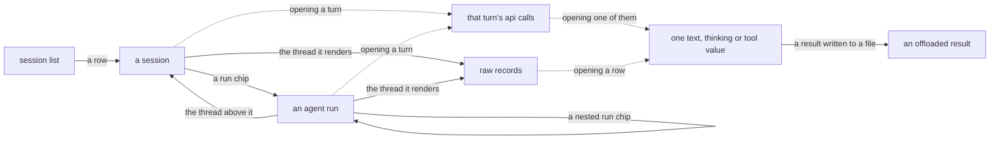

# The trace viewer

`aiobserve view` serves the trace store in a browser, letting you view a session instead of querying it. It binds only to `127.0.0.1`, opens the store read-only, and ships only assets it has vendored. Run `aiobserve view --help` for flags; see [the trace-viewer design](../plans/trace-viewer/design.md) for the design behind it.

## What it shows

Solid edges are pages, one URL each: `/`, `/session/{session_id}`, `/session/{session_id}/run/{run_id}`, `/session/{session_id}/records/{source}`, and `/session/{session_id}/offload/{name}`. Dotted edges are fragments that the open page fetches in place, one value per request. Every route is declared in `src/aiobserve/view/app.py`.

The list at `/` has one row per session, showing when it started, its title and project, and its rollup counts, cost, tokens, and time. Every column heading sorts by that column; clicking it again reverses the order. A cost with a `*` beside it includes calls to a model our price table lacks, so the total is a floor. The row cuts transcript text to a head: the title and project path to 100 characters, and the skills to the first four names with a count of what was left. The session's own page shows the full title, project path, and skill list.

The form above the list filters by project, date range, a skill the session ran, or a floor on failed tool calls. The project filter takes the recorded path exactly, so it is narrower than the CLI's `--project`, which also takes the sessions a checkout's worktrees recorded. Filters stay in the sort headings and pager, so reordering or turning the page keeps them; the masthead link clears everything. The footer's citation names each filter after the paging, so the line reproduces the rows that were on the screen.

A session page at `/session/{session_id}` opens with the header from the `sessions` row, followed by the main-source turn timeline in order, one page of turns at a time. Each turn shows its prompt or command, its counts, and its cost. A run spawned from a turn appears as a chip on that turn, with any run it spawned nested under it. Two rows make the page's numbers match the header: an unattributed row for calls that sit under no turn, and an unattached section for runs that resolve to neither a turn nor a run of the session. Every list on the page is capped — the turns, the runs under each of them, the compaction markers, and the header's own skills and PR links. Each says how much the cap left behind and, where possible, links to the page that holds it.

Opening a turn fetches its api calls one page at a time. Each call shows the model, the tokens, the cost, a preview of what it wrote, and a row for each tool call it made. Everything in that fragment is a preview — the full text, the thinking, and one tool's arguments and result each load on their own when you open them, one value per fetch.

A run chip links to `/session/{session_id}/run/{run_id}`, the same kind of page for one agent run: its header, the thread above it as a trail of links, its own turn timeline, and the runs under it that no turn of its timeline claims. The trail stops where the store stops naming parents — a fork's spawning call lives in files this store may not hold, and a guess in a breadcrumb is a wrong citation.

Where [an enrichment pass](enrichment.md) has run, its output sits beside what the store recorded. The session's description, category, outcome, and one line of friction appear under the header; each turn in the timeline carries its own description and the two tags. A run chip carries the tags only because its description appears on the run's own page, where the run page shows it too. The session list carries the line beside each title, cut to a row's head like the title itself, with the two tags — and never a stale one, because the list joins the words a pass wrote, not the versions that would judge them. A `stale` tag means the row was written under a prompt or taxonomy version this build has moved past — a reason to re-run a pass, not a reason to distrust the words. A store no pass has touched holds none of these tables, and its pages show nothing at all: absence is the ordinary case, and an item a pass has not reached yet looks the same. An agent run's turns are described by the run rather than one apiece, so a run page's timeline carries no descriptions.

Every timeline links to its thread's raw transcript at `/session/{session_id}/records/{source}`. Each row shows the archived line's number, record type, length, and head. Opening a row fetches the whole line. Each turn also links to the line that carries it, so a rendered turn and its record reach each other in one click.

A tool result Claude Code wrote to a file instead of the transcript links to `/session/{session_id}/offload/{name}`. Those files run to tens of megabytes, so the page serves the content in chunks and returns the offset of the next one. The name is a key into `offload_files`, never a path the server opens.

## URLs are the citation surface

Every page is a plain GET you can paste into a report or a message. The list takes `sort`, `direction`, `page`, `size`, and the filter keys; a session or run takes its ids. An unknown key, an unknown sort or direction, a filter value of the wrong type, or a page outside its bounds returns 400 rather than guessing. Sort keys are column names and filter keys are fixed predicates, so a citation says what produced the rows and their order — and request text reaches SQL only as a bound value.

Session pages use natural ids, so a report that cites `(session_id, source, line_no)` keeps citing the tuple. The URL comes from that tuple, and a port or route change breaks nothing already written down. That tuple has a page of its own: `/session/{session_id}/records/{source}?after={line_no - 1}#L{line_no}` opens the records browser on the cited line.

A timeline cursor reads the same way, and citing one turn takes the same shape. A session page takes `after`, `turns`, and `chips`, where `after` is *the last turn index already shown*, so `/session/{session_id}?after={turn_index - 1}#turn-{turn_id}` opens that turn first on the page. Paging moves forward only and uses the turn index rather than a row count, so a link keeps opening the same turns however much the session grew after it was written down.

## Reading while an extract runs

The viewer holds no connection between requests, so `aiobserve extract` can take the write lock whenever the viewer is idle. The collision goes both ways, and neither side retries:

- An extract that starts while a page is mid-request fails with DuckDB's lock error. Reload the page and run it again
- A page loaded while an extract holds the lock answers 503 saying the store is being written. It serves again as soon as the writer lets go
- A re-extract that bumps the schema under a running viewer answers 503 naming the version this build reads. Restart the viewer

Launching against a store this build cannot read, a store that is not there, or a port already serving fails at startup instead of opening a browser onto an error page.

## What keeps a page small

A viewer that renders a whole transcript hangs, so no query behind a page selects a column that holds what the agent read or wrote — `raw`, `text`, `thinking`, `result`, `input`, `content` — or a name someone else chose for it — `agent_type`, `model`, `description` — without truncating it in SQL. The scan in `tests/view/test_bounds.py` holds the set. A per-value fetch is the declared exception: one tool's result or one transcript line, one value per request, so it tops out at the largest value in the store rather than a page of them. Rendering keeps that promise: JSON is re-indented only while indenting stays cheap, because indenting is quadratic in nesting and 10 KB of nothing but `[` would otherwise serve 50 MB. A value nested past what anyone reads is served as it was stored.

Every page size is bound in one place: `src/aiobserve/view/bounds.py` names each size beside its ceiling, and a hand-typed `?size=` past a ceiling returns 400. A size that a query binds keeps its default in the manifest, where the parameter is declared. The payload bound comes from the ceiling because a size is something a reader types. A row's own markup costs what it was measured to cost against the canonical store — the fixtures are redacted down to a few characters and project nothing — while every character of transcript content the row carries counts as five bytes, which is what `&` escapes to. The turn fragment's two sizes multiply, so its ten calls of twelve tool rows spend the budget and `?calls=` only goes down from the default.

The session timeline is paged the same way, with two sizes that multiply: twenty turns to a page, eight run chips to a turn. The unattached list also contains chips and appears on every page, so the route refuses a pair whose `(turns + 1) × chips` passes 200 run rows — the budget the ceiling affords, and most of what it buys. A capped list says how many items it left and links to the page holding them all, `?turns=1&chips=100`, which fits the widest forest the corpus records — 94 runs under one turn — on a page of its own. That page weighed 33.6 KB against `data/traces.duckdb` on 2026-08-07, and the largest page any legal pair of sizes can ask for projects to 483 KB at the worst character: 456 KB of turn and run rows, 12 KB of compaction markers, and 15 KB for everything else the page carries.

Enrichment is most of the difference between that figure and the 350 KB ceiling this page held before it. A described run row costs half again what a bare one does, and 200 of them appear on the widest page — which is why a chip shows the two tags and not the description behind them. Cutting the run budget instead would have put the widest forest the corpus records behind a "+N more" nobody can open, so the ceiling rose to 500 KB.

The list is the other page that grows with a corpus, and it is bound the same way: 125 sessions to a page, the default and maximum both, with each row's strings cut to 100 characters and its skills to four names of 20. The cut is composed around the query rather than made in it because the filters match whole values — a project path cut to its head would match nothing, and a skill outside the first few would disappear from a filter that finds it. The filter box is bound too, at the 10 busiest projects, with each path offered whole or left out for the same reason. A described row also carries what the pass said: the line cut to the same 100 characters and the two tags. That gives 10,000 B of chrome plus 125 rows of 3,400 B — 1,300 B of measured markup and 2,100 B of heads at the worst character — or 435 KB against the 500 KB ceiling.

That last 15 KB of a session page is the header, the one part that no size a reader types bounds — a session's PR links grow with every PR it opens. So the query cuts what the header shows: each string to a head, each of its two lists to its first members with a count of what it left, and the session's own description and friction to 200 characters apiece. The compaction markers are capped the same way and for the same reason, at 20 to a page against the 18 the densest recorded thread holds. `tests/view/test_bounds.py` holds the ceiling and everything that must fit under it, and re-measures the header's own weight on every run.
