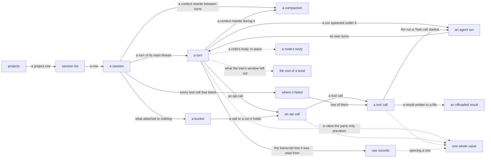

# The trace viewer

`aiobserve view` opens the trace store in a local browser. Everything a session recorded is a node with a page of its own — the session, its turns, the runs it spawned, the api calls, the tool calls, the compactions between them — and you read one node at a time, with a tree beside it showing where that node sits. Copy the URL of anything you want to cite.

The server binds only to `127.0.0.1`, opens the store read-only, and serves only vendored assets. Run `aiobserve view --help` for flags. [The node-browser design](../plans/viewer-node-browser/design.md) holds the choices behind the tree, and [the trace-viewer design](../plans/trace-viewer/design.md) the ones behind the pages around it. Editing a template is governed by `.claude/rules/viewer-ui.md`.

## Follow a session down to any record it holds



Solid edges lead to pages with their own URLs. Dotted edges fetch a fragment into the open page.

| Page | Route |
| --- | --- |
| Projects | `/` |
| Session list | `/sessions` |
| A session | `/session/{session_id}` |
| A turn | `/session/{session_id}/thread/{source}/turn/{turn_id}` |
| An agent run | `/session/{session_id}/run/{run_id}` |
| An api call | `/session/{session_id}/thread/{source}/call/{api_call_id}` |
| A tool call | `/session/{session_id}/thread/{source}/tool/{tool_call_id}` |
| A compaction | `/session/{session_id}/thread/{source}/compaction/{compaction_id}` |
| A thread's calls under no turn | `/session/{session_id}/thread/{source}/unattributed` |
| The runs nothing placed | `/session/{session_id}/unattached` |
| Where a session failed | `/session/{session_id}/errors` |
| Raw records | `/session/{session_id}/thread/{source}/records` |
| An offloaded result | `/session/{session_id}/offload/{name}` |
| The SQL behind a page | `/query/{name}` |

`src/aiobserve/view/app.py` declares every route, fragments included. Nothing renders in the pane that a cold GET of its own URL doesn't render whole, tree and all.

## The landing page counts projects

`/` lists the projects the store holds sessions for, most recently active first, with sessions and spend over the last 7 days, the last 30, and all time. The page is [bounded](#hard-bounds-cap-every-page-most-at-500-kb) like every other, so a store holding more projects than it shows ends with the number it left out. A row opens the session list filtered to that project. Sessions recorded from a checkout's worktrees count under the checkout, and sessions with no recorded directory gather into an unlinked `(no project)` row. The footer cites the query and `as_of`, the date both windows were measured back from, so the page reproduces tomorrow.

## The session list keeps the query visible

The list has one row per session. A row shows how long ago the session started over its timestamp, its title and project, rollup counts, its tool errors as a rate over the count, cost over output tokens, wall time over active time, the agent types it spawned with a count of each, and its skills. A column showing two values is one cell read as two lines: the value the column is scanned for, and the texture under it. Over a store an enrichment pass has run against, a Work column says what kinds of turn the pass found. Every column heading sorts by that column; click it again to reverse the order. Sessions the store has no value for sort last either way — a session it knows nothing about is neither the newest nor the oldest. Errors sorts by the count rather than the rate: one failure in one call is 100% and not the session someone ranking by errors is looking for. A `*` after the cost means the session called a model missing from the price table, so the shown total is a floor. A project directory under the home of whoever is reading prints with `~` in its place, on this page and on the landing page and the session header; the link, the filter and the suggestion box still carry the path the store holds, because that is what a filter matches.

Rows show only the head of long text: 100 characters for the title and project path, four skill names and four agent types followed by the number omitted, and three kinds of work. The session header shows five skill names of up to 60 characters along with its other fields; it too stays bounded.

The form above the list filters by project, date range, skill, or a minimum number of failed tool calls. The project filter matches a path prefix, the same rule as the CLI's `--project`: filtering by a checkout keeps the sessions its worktrees recorded.

Filters survive sorting and paging. The `clear` link beside the form drops them. The footer prints a citation after paging and names every active filter, so it describes the rows on screen.

## The tree opens one path and nothing else

Beside every node page is the session's tree, with one path open: the selection, its ancestors, each ancestor's children, and the selection's own children. Clicking a row selects it, which opens that row's path and closes the one you left. There are no independent twisties and no way to open two branches at once, so no session makes the tree wider than one open path. Its depth is a hard limit rather than a cap: an open path runs at most 16 levels, and a node deeper than that fails instead of serving a page the byte arithmetic never priced. The deepest chain the recorded corpus holds is 14 — a tool call inside a run five spawns down — so the margin is one more spawn level.

A session's children are the main thread's turns, the compactions that happened between two of them, its calls that answer no turn, and the runs nothing placed. A turn's children are its api calls and the compactions that happened while it ran, in the order they happened; an api call's are its tool calls. An agent run reads like a session: its children are its own turns. A run renders under the *turn* it belongs to, right after the api call that spawned it — the run is the turn's child, not the call's, and a `Task` tool call keeps its own slot with a link to the run at the head of its page.

Above the rows is the fold: **full**, **no api calls**, **agents only**, with the one in force marked. Each is the node you are reading under a different tree, so a switch keeps your place and your knobs — the fold is [`?nav=`](#urls-preserve-the-query-behind-what-you-saw), and the control is the only link on the page that changes it.

Every row with spend carries a bar along its edge: its share of what the session cost, logarithmic over three orders of magnitude, because a session's cheapest turn and its dearest are that far apart and a linear scale draws all but the largest as nothing. Tool calls have no bar; what a tool call took is the api call's.

A level opens on 200 children, and a `+N more` row says how many it left out. Clicking it fetches the rest of that level and stands the rows in its own place, so a wide branch opens where it is rather than sending you to another page. The row the open path descends through is always kept, inside the window. Nothing bounds what that click can bring back: a branch of ten thousand children answers with ten thousand rows.

A tool call that came back an error carries an `error` mark on its row, in the same red the children log and the list use.

## Jump straight to where a session failed

The tree opens one path, so a failure five spawns down a run tree is behind everything in front of it. `/session/{session_id}/errors` is the way past that: every `is_error` tool call the session made, on every thread, in the order they happened, each row a link to that call's own page. Every node page of a session that failed something carries the count and the way in, under the walk controls.

Standing on a failed tool call, the same block gains a step to the failure before it and the one after — across threads, because the list is the session's rather than one thread's. No other page runs the query: a pane reading anything else has no step to offer.

The list is bounded like the landing page rather than paged: it shows the first 100 failures in that order and says how many it left. The stepper reads the same capped list, so a failure past the cap is one neither surface reaches. A session that failed nothing has no page here — the URL is a 404, worded apart from a session the store never held.

## The pane reads one node

The pane leads with the crumb chain down to the node, then the node's label and the facts the store holds for it. Under those:

- What an enrichment pass said about the node, when a pass has reached it
- The node's own fat values, cut to 4,000 characters, each with a link that fetches the rest: a turn's prompt, a run's task brief, an api call's text and thinking, a tool call's input and result, and the command a `Bash` call ran. A turn typed as a slash command has no prompt among its values: what was typed is the `<command-…>` wrapper Claude Code expanded it into, and the two facts inside it — the command and what followed it — stand as values of their own. The wrapper is still what was sent, and the thread's transcript has it whole
- The thread's transcript, and — for a turn — the archived line it was read from, in a `<details>` that fetches on open
- The children log: one numbered page of 100 children, as a table. A column per number the children are told apart by, each under a heading that names it — a turn's api calls read nothing like its tool calls, and a start time is not a duration. One wide column names the child and links to its page, and a `View` button opens the child's own pane in place, as a row of the same table, without leaving the parent. An opened body stops there; what's under it is a count and a link. The heading counts the level, not the page; a level running past one page carries prev and next under it, and says which page of how many you are on
- A tool row is named by what the tool was asked, because that is what tells two calls of one tool apart: a `Read`'s file path, relative to the session's project directory where the file is inside it and absolute where it is not; a `Bash` call's description, with the command itself under it; and the head of the input JSON for every other tool
- Prev and next, two buttons that read the level the node is on: the row beside it, and at the end of the level whatever follows the branch. Neither descends — going down is what the tree is for — and a step that leaves the level shows `↑` instead of an arrow along it. Each names the neighbour's kind and its label. The buckets and the compactions are stops like any other, and the controls ignore what the tree was capped to: a reading order that shortened with the sidebar would skip nodes silently
- [Where the session failed](#jump-straight-to-where-a-session-failed): how many tool calls it failed, the way to the list of them, and — on a failed call — the step to the failure before it and the one after

A value is marked up in the syntax the record says it is written in: the JSON a tool was passed, the SQL behind a page, the shell a `Bash` call ran, and the file a `Read` returned — read off the name the call asked for, so a `.md`, `.py`, `.sql` or `.sh` result is shown as its source rather than rendered. A tool result is evidence, and a heading made out of a `#` is a character the agent saw and the page does not. What a model wrote is prose: the pane previews it as plain text, and the fetch that opens it whole renders it as Markdown, with a fenced block inside marked up in the language the fence names. Anything the viewer cannot place prints as it was stored, and so does a value past 256,000 characters, with a line saying why. Every page's footer cites the queries behind it, and each citation links to `/query/{name}`, which shows that query's SQL under the bindings the page used.

`agent_runs.description` shows as **task brief**: it is the brief Claude Code recorded for the run, not a description of what the run did. On this screen "description" always means enrichment.

## Enrichment appears beside the recorded trace

After [an enrichment pass](enrichment.md), the viewer places its output beside the stored telemetry. A `✨` marks every string a model wrote rather than a session — on the tree row, the crumb, the log line, and the walk control, wherever a description stands in for a label. The pane carries the one glyph that explains itself: hover it for the model, when it ran, the prompt and taxonomy versions, and whether the row is stale. `stale` means the pass used an older prompt or taxonomy version, so rerun the pass; it does not mean the saved description is false.

The session list adds each session's one-line description and two tags, cutting the line to the same 100-character head as the title. It does not show `stale` because the list joins the words written by a pass without loading the versions needed to judge them.

A store that has never been enriched has none of the enrichment tables. The viewer then shows no enrichment fields, and cites no enrichment query. An item the current pass has not reached looks the same.

## URLs preserve the query behind what you saw

Every page is a plain GET you can paste into a report or message. One rule shapes every path: **a word saying what kind of id comes next stands in front of each id, so no two ids sit side by side**. A turn reads at `/session/{session_id}/thread/{source}/turn/{turn_id}` — a session, then the thread the node was recorded on (`main` or a run's id), then the turn. A run is the exception the rule allows: its id is also the thread its rows carry, so `/session/{session_id}/run/{run_id}` says it once. Fragment URLs obey the rule too, and a node's fragment is its own path under a prefix: `/fragment/body/session/{session_id}/thread/{source}/turn/{turn_id}`. `tests/view/test_app.py` holds every route the app exposes to the rule.

Node pages take four knobs, and every link on a page carries the ones that aren't defaults, so a click serves the URL it displays:

| Knob | What it does |
| --- | --- |
| `?nav=full` | The whole tree. The default |
| `?nav=noapi` | The api calls folded away, each turn's tool calls standing directly under it |
| `?nav=agents` | The runs alone, each under the run that spawned it — the session's org chart |
| `?kin=` | Children per open level, at most 200 |
| `?log=` | Rows in one page of the pane's children log, at most 100 |
| `?detail=` | Characters of each value the pane previews, at most 4,000 |

The three sizes only go down. Each default is also its ceiling, because the page's byte bound is arithmetic over the defaults and there is no headroom to spend. A size outside its range or a `nav` the viewer doesn't have returns 400 rather than a guess.

A value's own URL — the one a preview's `+N more character(s)` link opens — answers 404 where the row is there and the column under it is empty: a `Read` ran no command, a slash turn typed no prompt of its own. Nothing links to one of those, so a request for one is a URL that was typed or kept.

How wide the tree is drawn is the one thing you set that no URL carries: it belongs to the screen you are reading on, not to the node you linked to, so a pasted link would hand someone else your column. Drag the handle between the tree and the pane — or focus it and press the arrow keys — and this browser keeps the width for every session you open.

The presets are the [fold above the tree](#the-tree-opens-one-path-and-nothing-else), and typing one into the URL does the same thing. Every preset leaves every visible node with a visible parent, and a level whose preset would hide the path you are standing on renders in full instead.

The session list accepts `sort`, `direction`, `page`, `size`, and its filter keys, and returns 400 for an unknown key, an unknown sort or direction, a filter value of the wrong type, or a page outside its bounds. Sort keys map to fixed columns, filter keys map to fixed predicates, and request values reach SQL only as bound parameters. A children log pages with `?page=`, numbered from one; page one is the node's own URL. A number below one is a 400, like any other size a URL carries out of bounds; a number past the level's last page is a 404, because only the level knows where it ends.

Reports cite raw records as `(session_id, source, line_no)`. The records URL derives from that natural key, so a later port or route change does not invalidate the saved tuple. This form opens the records browser on the cited line:

```text
/session/{session_id}/thread/{source}/records?after={line_no - 1}#L{line_no}
```

## Large values open only when you ask

The records page shows each archived line's number, type, length, and head; opening a row fetches the full line. The record the page opens on — the first row, which is the one a citation names — arrives open with its line already fetched, as long as it is under 15,000 characters. A record wider than that waits for a click like every other row: nothing bounds how long an archived line is, the store holds one of 7.6 million characters, and a page that pulls one unasked is a page nobody budgeted. Every turn links both to its thread's transcript and to the one line it was read from, so you can move between the modeled turn and the archived record in one click.

When Claude Code writes a tool result to a file instead of the transcript, the result links to `/session/{session_id}/offload/{name}`. Some offloads are tens of megabytes, so the page serves them in chunks and returns the next offset. The route treats `name` as a key into `offload_files`; it never opens a path from the URL.

## Extracts and page loads can contend for the store

The viewer closes its database connection after each request, leaving `aiobserve extract` free to take DuckDB's write lock while the viewer is idle. Neither side retries a collision:

- If an extract starts while a page request holds the store, the extract fails with DuckDB's lock error. Reload the page, then run the extract again
- If a page loads while an extract holds the lock, the viewer returns 503 and says the store is being written. Reload after the writer releases the lock
- If a re-extract changes the schema while the viewer runs, the viewer returns 503 with the schema version this build expects. Restart the viewer

The viewer fails at startup if the store is missing, its schema is unsupported, or the port is already in use.

## Hard bounds cap every page, most at 500 KB

A browser can hang if the viewer renders a whole transcript. The viewer therefore bounds the row counts and text behind pages at the SQL boundary. Those queries do not select an uncut column that can hold agent or user content: `raw`, `text`, `thinking`, `result`, `input`, `content`, `agent_type`, `model`, or `description`. `tests/view/test_bounds.py` enforces that rule.

Full-value requests are the declared exception. Each returns one transcript line, prompt, task brief, text block, thinking block, or tool value, so its size depends on the largest matching value rather than a page of them. Offloads remain chunked. JSON is re-indented only while doing so remains cheap; deeply nested data stays as stored because indentation work grows quadratically with nesting.

`src/aiobserve/view/bounds.py` defines each page size beside its ceiling. A typed size above its ceiling returns 400. The payload checks charge each transcript character at five bytes, the longest HTML escape, and add measured markup costs from the canonical store.

| Surface | Default and limit |
| --- | --- |
| Session list | 104 sessions; each long string is cut to 100 characters, skills and agent types to four 20-character names, and work to three |
| Projects | 100 projects; the path is cut to 100 characters |
| A session's errors | 100 failed tool calls; each label is cut to 110 characters |
| Tree | 200 children per open level, 16 levels deep, each label cut to 110 characters |
| Children log | 100 rows a page, each string cut to 300 characters |
| Previewed value | 4,000 characters, with the rest a fetch away |
| Raw records | 100 rows by default, at most 200 |
| Offload | 50,000 characters by default, at most 60,000 |
| Syntax highlighting | 256,000 characters, above which the value prints as stored |

The worst node page comes to 4,865,334 bytes of the 5,050,000 a node page is allowed — its own budget rather than the 500,000 every other page is weighed against, because the tree is a window a reader widens in place and not a page. The tree is what multiplies: an open path is `1 + 16 × (200 + 1)` = 3,217 rows, and a row is pinned at 1,262 bytes, which is 4,059,854 of the page, four fifths of it. The rest is 16 crumbs at 880 bytes, 100 log rows at 6,115, a pager at 600, three previewed values — two of prose at 20,600 and one marked up in its own syntax at 120,600 — and 17,500 of chrome. The 184,666 spare is held on purpose: 154,416 of it is the kind glyph the tree is about to carry — 48 bytes a row over 3,217 rows — and the rest is the rounding every ceiling here carries. A marked-up preview is priced at 30 bytes a character against a prose preview's five: a span and a class around every token the lexer finds. A log row is the dearest thing on the page after the tree: it prints up to three of the store's own strings at 300 characters each, which is what a reader gets for reading a level without opening it. `TREE_ROW_BYTES` is measured through the app rather than budgeted, at a label of nothing but `&` and the longest query string a link can carry, and pinned with no slack in either direction: a byte of slack there is 3,217 bytes of page, and the room above is spoken for. Nearly all of a row is its URL written twice, the `href` a reader follows and the `hx-get` htmx fetches — what the fetch then does with the response is written once on `#tree-rows` — so a store whose agent runs carry longer ids than the recorded corpus does is a re-measure.

A session's errors list grows the way the corpus pages do — nothing about a session caps how often its tools fail — so it is bounded the same way and projects to 98 KB: 2.5 KB of chrome plus 100 rows at 950 bytes, of which 550 is a label of nothing but `&`.

The session list is bound independently of corpus size. Its filter box offers the 10 busiest project paths that fit its bound, whole or not at all; a cut path would filter by a directory nobody named. The projects page cuts a long path the same way and leaves that row unlinked. The same rule keeps row filtering correct: the viewer filters whole titles, paths, and skill lists, then cuts only the rows it renders. The worst-case list projects to 499 KB: 10 KB of page chrome plus 104 rows at 4.7 KB each.

A session header does not have a reader-controlled size, so its query cuts every string, skill list, PR list, session description, and friction line. `tests/view/test_bounds.py` measures these fixed costs and checks every route the viewer exposes against its own ceiling, once with no query string and once with the dearest knobs a URL can carry.
