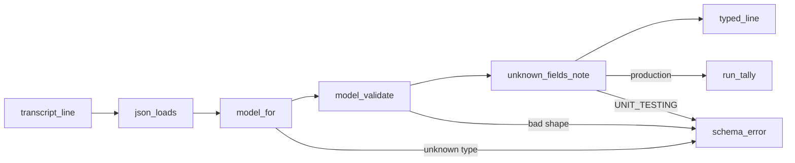

# Design: read the transcript through the record models

The parser reads each transcript line as an instance of its record model instead of a dict. The models in `src/hyphae/extract/records/` stop being documentation held to the parser by an AST test and become the parser's own types. The decisions behind this shape are in `records-as-parser_questions.md` beside this file.

## Problem

`src/hyphae/extract/transcript.py` reads `Line.record` as a dict at 51 sites, each naming a field by string. The pydantic models in `records/shapes.py` and `records/blocks.py` describe the same fields with a `description` and a `Cited` recording, but nothing runs them: the only thing tying a model to the parser is `tests/extract/test_records__drift.py`, which walks the parser's AST for string literals and checks them against the documented fields. Two shallow modules describe one schema, and the seam between them is a grep.

The deletion test says which one earns its keep. Delete the drift test and the models rot silently. Delete the string reads and make the models the parser's types, and the drift test has nothing left to check. The constraint that decides the shape is the parsing rule in `.claude/rules/python.md`: an unrecognized shape crashes with the session and line. Validation has to keep that promise, and it has to stay cheap: on the fixtures it measured at 0.3× the cost of `json.loads`, over a canonical store of 703,766 records in 627 sessions (2026-09-03).

## Call paths, current → proposed

Current: `ClaudeCodeExtractor.extract` (`extract/claude_code.py`) calls `read_lines`, which runs `json.loads` and `_check_type` on each line and yields `Line(line_no, record: dict, raw)`. `parse`, `session_of`, `pr_links`, `workflow_launches`, `agent_runs.py` and `replays.py` then index the dict.

Proposed: `read_lines(path, session_id, unknown_fields)` runs `json.loads`, resolves the model with `shapes.model_for`, and calls `model_validate`. It yields `Line(line_no, record: Record, raw)`. A pydantic error becomes a `TranscriptSchemaError` naming the session, line, model and field path, never the value. After validating, `read_lines` hands the instance to `UnknownFields.note`, which walks `model_extra` on the record and every nested `Described` it holds. Every reader downstream takes attributes and narrows kinds with `isinstance` against the model classes: `isinstance(line.record, UserRecord)` replaces `record["type"] == RecordType.USER`.



## File-tree diff

```
src/hyphae/
  settings.py                              + UNIT_TESTING, read once from the env
  cli.py                                   ~ `hp extract` prints the unknown-field tally after its summary
  extract/
    claude_code.py                         ~ the extractor owns one UnknownFields per instance and passes it to read_lines
    transcript.py                          ~ Line.record is a Record; 51 dict reads become attribute reads
    agent_runs.py, replays.py              ~ timestamp_of takes a Record
    records/
      shapes.py                            ~ ArchivedRecord; ARCHIVED_UNREAD replaces UNMODELLED; OBSERVED_UNREAD deleted; model_for is total
      blocks.py                            ~ type discriminators on every block; content lists become discriminated unions; result blocks modelled
      unknown.py                           + UnknownFields
tests/
  extract/test_records__drift.py           - deleted
  extract/test_records.py                  ~ registry totality and one no-string-reads leaf move in
  extract/test_transcript__unknown.py      + strict crash, lax tally, nested walk, first sighting
  extract/test_records__census.py          + HYPHAE_LIVE_STORE-gated: every raw_records row validates with no unknown field
  fixtures/invented-unknown-field/         + one spine record with an invented top-level field and one with an invented usage field
pyproject.toml                             ~ pytest-env sets UNIT_TESTING=1 for every pytest invocation
CONTEXT.md, docs/schema.md, .claude/rules/python.md   ~ record model term; the "declare what you rely on" rule becomes structural
```

## Key contracts

```python
# extract/transcript.py
@dataclass(frozen=True)
class Line:
    line_no: int
    record: Record        # was dict[str, Any]
    raw: str

def read_lines(path: Path, session_id: str, unknown_fields: UnknownFields) -> list[Line]: ...
def timestamp_of(record: Record) -> datetime | None: ...   # None unless isinstance(record, Timestamped)

# extract/records/shapes.py
def model_for(record: dict[str, Any]) -> type[Record]: ...  # total over both registries; raises TranscriptSchemaError otherwise
class ArchivedRecord(Record): """A kind the store keeps verbatim and no reader opens."""
ARCHIVED_UNREAD: dict[RecordType | ArchiveRecordType, str]   # member → why nothing reads it; feeds dispatch

# extract/records/blocks.py: pydantic dispatches nested shapes, so each carries its discriminator
class TextBlock(Block):
    type: Literal[ContentBlock.TEXT]
UserMessage.content: str | list[Annotated[TextBlock | ToolResultBlock, Field(discriminator="type")]]
ToolResultBlock.content: str | list[Annotated[TextResult | ImageResult | ToolReferenceResult, Field(discriminator="type")]]

# extract/records/unknown.py
class UnknownFields:
    """Fields a modelled record carried that no model declares."""
    def __init__(self, *, strict: bool) -> None: ...
    def note(self, record: Record, session_id: str, line_no: int) -> None: ...
        # strict: raise TranscriptSchemaError on the first sighting
        # lax: tally (model path such as `assistant.message.usage.foo`) → first (session, line), session count
    def report(self) -> str: ...   # empty when nothing was seen

# settings.py
UNIT_TESTING: bool = os.environ.get("UNIT_TESTING") == "1"
```

`model_for` stays the record-level dispatch rather than one pydantic union over twelve models: it already exists, it keys on `type` and `subtype` in one lookup, and it is where the crash for an unknown kind already lives. Blocks are dispatched by pydantic because they sit inside a validated field.

The error message rule in `extract/errors.py` holds: format a `ValidationError` with `errors(include_input=False, include_url=False)` and print the location and message only.

## Chosen test seam

The extractor's own interface: `ClaudeCodeExtractor.extract` over the redacted fixtures, producing a `SessionTrace` the existing `tests/extract/` leaves already assert on. Those tests do not change and are what proves every reader slice. The model leaves in `test_records.py` stay as they are, since they were always tests of the parser's types; only the drift file goes. `UnknownFields` is tested at its own interface with the invented fixture, because a crash on a field nobody has recorded cannot come from a recorded session.

## Slices

Each slice is one commit on the branch and is green under `mise run check` on its own.

1. **Validate every line and tally the unknown.** `settings.UNIT_TESTING`, pytest-env, `UnknownFields`, `ArchivedRecord`, a total `model_for`, block discriminators. `read_lines` validates and notes but `Line` keeps the dict as `fields` beside the new `record`, and the readers are untouched. The `hp extract` tally line lands here. Verified by `test_transcript__unknown.py` and by the census test against the live store, which is the first real question this change asks: does the canonical corpus carry a field no model declares?
2. **Session.** `session_of`, `_last_field`, `pr_links`, `fork_context`, `timestamp_of` and its two callers read attributes.
3. **Turns.** `_turns`, `_prompt`, `_block_prompt`, `_required_timestamp`.
4. **Api calls.** `_api_calls`, `_fallback_from`, `_blocks`.
5. **Tool calls.** `_tool_calls`, `_tool_results`, `_advisor_results`, `_result_text`, `workflow_launches`. The `ResultBlock` and `AdvisorResult` crashes move into the models here.
6. **Compactions and the dict's exit.** `_compactions`; delete `Line.fields`; `rg '\["[a-zA-Z_]+"\]' src/hyphae/extract` reads zero, pinned by the one surviving drift leaf.
7. **Retire the drift test.** Delete `test_records__drift.py`, move the registry-totality leaf into `test_records.py`, update the three docs and run `mise run cogs`.

## Decisions

- **Models become the types; the drift test goes.** Rejected: keep both and tighten the AST walk. The walk can only find string literals, so it cannot see a field read through a helper, and it costs a test module the size of the parser
- **`UNIT_TESTING` is one env-backed constant, set by pytest-env for every pytest invocation.** Rejected: setting it in `tests/conftest.py` at import, which depends on import order and breaks the moment a test imports `hyphae` first; setting it in the `mise.toml` test task, which misses a developer running one file and `mise run mutate`
- **The extractor builds its own `UnknownFields` and exposes it.** Rejected: injecting it through the constructor. There are 42 construction sites and one adapter, so the seam would be hypothetical
- **Strict in tests, tally in production, one line per field with its first sighting.** Rejected: crashing production, which turns a harmless new field into a stopped run; logging every record, which prints a field 700,000 times
- **No exit-code flag on `hp extract`.** Rejected because a new field is information, not failure. The census test is the gate, and it runs where a person is looking
- **One `ArchivedRecord` for every kind nothing reads, with a reason per kind.** Rejected: a model per archive type, sixteen empty classes documenting nothing; and dropping the reasons, which would let a kind slip into "unread" without anyone saying why
- **Registry enums stay hand-written and the models bind to them.** Rejected: deriving the registry from the models, which loses the place to record a kind before it has a model
- **Census is a permanent env-gated test over `raw_records`.** Rejected: an `hp` subcommand, which is for end users; a one-off script, which rots

## Out of scope

- `SessionTrace` and the store schema do not change. Every row the exporter writes is the same
- Model fields keep Claude Code's camelCase names. Renaming them would put a translation table between the docs and the transcript
- Non-archive kinds nothing reads today (`away_summary`, `api_error`, the others in `UNMODELLED`) are not modelled beyond `ArchivedRecord`. Modelling them is the next pass once the census says what they carry
- The enrichment stamp and the price tables (`C10`, `S27` in `plans/refactor-audit-2026-08-30/findings.md`) are separate candidates

## When the schema moves

- A new record type, subtype or block type crashes with session and line, as today. `model_for` raises for a record kind; pydantic's discriminator error becomes a `TranscriptSchemaError` for a block
- A new field on a modelled record crashes the suite and prints one line after `hp extract`. The census test turns it red against the live store
- A field that vanished or changed type fails validation, and the error names the model and field path without the value

## Designed against

`tests/fixtures/spine/` (Claude Code 2.1.221) for every modelled shape, `tests/fixtures/registry_zoo/` for one record of every registered kind, `tests/fixtures/invented-unknown-type/` for the existing crash path, and the canonical store on 2026-09-03 for the census. Whether `UserMessage.content` can hold a block kind beyond `text` and `tool_result` in the corpus is a hypothesis the census settles in slice 1.

## Open questions

- What the census finds. If the corpus carries fields no model declares, each becomes a model field with its citation before slice 2, or an `ARCHIVED_UNREAD` reason if it belongs to a kind nothing reads
- Whether `ToolUseResult`'s string and list forms validate cleanly under smart-union across the whole corpus. The census answers this too
