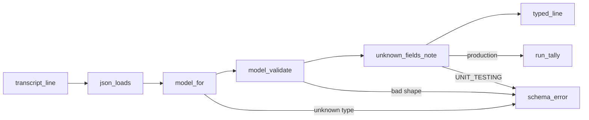

# Design: read the transcript through the record models

The parser reads each transcript line as an instance of its record model instead of a dict. The models in `src/hyphae/extract/records/` stop being documentation held to the parser by an AST test and become the parser's own types. The decisions behind this shape are in `records-as-parser_questions.md` beside this file.

## Problem

`src/hyphae/extract/transcript.py` reads `Line.record` as a dict at 93 sites, each naming a field by string. The pydantic models in `records/shapes.py` and `records/blocks.py` describe the same fields with a `description` and a `Cited` recording, but nothing runs them: the only thing tying a model to the parser is `tests/extract/test_records__drift.py`, which walks the parser's AST for string literals and checks them against the documented fields. Two shallow modules describe one schema, and the seam between them is a grep.

The deletion test says which one earns its keep. Delete the drift test and the models rot silently. Delete the string reads and make the models the parser's types, and the drift test has nothing left to check. The constraint that decides the shape is the parsing rule in `.claude/rules/python.md`: an unrecognized shape crashes with the session and line. Validation has to keep that promise, and it has to stay affordable: over the canonical store's 705,431 records, resolving and validating a record costs 1.29× the `json.loads` it follows and the `UnknownFields` walk another 0.60×, so the whole reader chain takes 55.4s where the dict version took 41.5s — about 14 seconds on a full re-extract (measured 2026-09-04).

The models today declare what the parser reads and nothing more. Walking every fixture record through `model_for` and `model_validate` and collecting `model_extra` on the record and every nested model finds 115 field paths no model declares (2026-09-03, 358 records, 0 validation failures). They fall into three groups, and each gets a different answer below: 45 are keys inside `toolUseResult`, whose shape belongs to the tool that wrote it; 17 sit on the six thin `system` subtypes nothing reads; the rest are envelope fields Claude Code writes on the kinds the parser does read, such as `userType`, `slug`, `agentId`, `promptId`, `message.role` and five `usage` fields.

## Call paths, current → proposed

Current: `ClaudeCodeExtractor.extract` (`extract/claude_code.py`) calls `read_lines`, which runs `json.loads` and `_check_type` on each line and yields `Line(line_no, record: dict, raw)`. `parse`, `session_of`, `pr_links`, `workflow_launches`, `agent_runs.py` and `replays.py` then index the dict.

Proposed: `read_lines(path, session_id, unknown_fields)` runs `json.loads`, resolves the model with `shapes.model_for`, and calls `model_validate`. It yields `Line(line_no, record: Record, raw)`. A pydantic error becomes a `TranscriptSchemaError` naming the session, line, model and field path, never the value. After validating, `read_lines` hands the instance to `UnknownFields.note`, which walks `model_extra` on the record and every nested `Described` it holds, and stops at a model marked opaque. Every reader downstream takes attributes and narrows kinds with `isinstance` against the model classes: `isinstance(line.record, UserRecord)` replaces `record["type"] == RecordType.USER`.



## File-tree diff

```
src/hyphae/
  settings.py                              + UNIT_TESTING, read once from the env
  cli.py                                   ~ `hp extract` prints the unknown-field tally after its summary
  extract/
    claude_code.py                         ~ the extractor owns one UnknownFields per instance and passes it to read_lines
    transcript.py                          ~ Line.record is a Record; 93 dict reads become attribute reads
    agent_runs.py, replays.py              ~ timestamp_of takes a Record
    records/
      evidence.py                          ~ Described.OPAQUE: the marker that stops the unknown-field walk
      shapes.py                            ~ the envelope fields the fixtures carry, declared; ArchivedRecord; ARCHIVED_UNREAD replaces UNMODELLED and takes the thin system subtypes; OBSERVED_UNREAD deleted; model_for is total
      blocks.py                            ~ Usage, Message and CompactMetadata gain their recorded fields; ToolUseResult is opaque; type discriminators on every block; content lists become discriminated unions; result blocks modelled
      unknown.py                           + UnknownFields
tests/
  extract/test_records__drift.py           - deleted
  extract/test_records.py                  ~ registry totality, the opaque set, the clean-corpus walk and one no-string-reads leaf move in
  extract/test_transcript__unknown.py      + strict crash, lax tally, nested walk, opaque stop, first sighting
  extract/test_records__census.py          + HYPHAE_LIVE_STORE-gated: every raw_records row validates with no unknown field
  fixtures/invented/invented-unknown-field.jsonl
                                           + one spine-shaped record with an invented top-level field, one with an invented usage field, one with an invented toolUseResult key
pyproject.toml                             ~ pytest-env, a new dependency, sets UNIT_TESTING=1 for every pytest invocation
docs/schema.md                             ~ regenerated: the four cog blocks grow by the declared fields
CONTEXT.md, .claude/rules/python.md        ~ record model term; the "declare what you rely on" rule becomes structural
```

The invented fixture is a file under `tests/fixtures/invented/`, not a directory of its own: `tests/conftest.py:corpus_transcripts` globs every other fixtures subdirectory into the shared corpus store, so a new directory would crash every tier that builds one.

## Key contracts

```python
# extract/transcript.py
@dataclass(frozen=True)
class Line:
    line_no: int
    record: Record        # was dict[str, Any]
    raw: str

def read_lines(path: Path, session_id: str, unknown_fields: UnknownFields) -> list[Line]: ...
def timestamp_of(record: Record) -> datetime | None: ...   # None unless the model declares `timestamp`

# extract/records/evidence.py
class Described(BaseModel):
    # A non-empty reason marks the model opaque: it declares the fields a reader opens and claims
    # nothing about the rest, so the unknown-field walk stops here. Exactly two models set it.
    OPAQUE: ClassVar[str] = ""

# extract/records/shapes.py
def model_for(record: dict[str, Any]) -> type[Record]: ...  # total over both registries; raises TranscriptSchemaError otherwise
class ArchivedRecord(Record):
    """A kind the store keeps verbatim and no reader opens: `type`, and the `uuid` and `timestamp` `raw_record` fills for every line."""
    OPAQUE = "archived verbatim; its fields are the archive's, not a claim"
ARCHIVED_UNREAD: dict[ArchiveRecordType | SystemSubtype, str]   # member → why nothing reads it; feeds dispatch

# extract/records/blocks.py
class ToolUseResult(Described):
    OPAQUE = "the tool's own report: keyed by nothing the value carries, one key set per tool, an open set"
# pydantic dispatches nested shapes, so each block carries its discriminator
class TextBlock(Block):
    type: Literal[ContentBlock.TEXT]
UserMessage.content: str | list[Annotated[TextBlock | ToolResultBlock, Field(discriminator="type")]]
ToolResultBlock.content: str | list[Annotated[TextResult | ImageResult | ToolReferenceResult, Field(discriminator="type")]]

# extract/records/unknown.py
class UnknownFields:
    """Fields a modelled record carried that no model declares."""
    def __init__(self, *, strict: bool) -> None: ...
    def note(self, record: Record, session_id: str, line_no: int) -> None: ...
        # walks model_extra on the record and every nested Described, stopping at OPAQUE
        # strict: raise TranscriptSchemaError on the first sighting
        # lax: tally (model path such as `assistant.message.usage.foo`) → first (session, line), session count
    def report(self) -> str: ...   # empty when nothing was seen

# settings.py
UNIT_TESTING: bool = os.environ.get("UNIT_TESTING") == "1"
```

`model_for` stays the record-level dispatch rather than one pydantic union over twelve models: it already exists, it keys on `type` and `subtype` in one lookup, and it is where the crash for an unknown kind already lives. For a `system` record it returns the subtype's model, `ArchivedRecord` for a subtype in `ARCHIVED_UNREAD`, and raises otherwise; `SystemRecord` stays the base of the four subtype models and stops being a fallback. Blocks are dispatched by pydantic because they sit inside a validated field.

`ArchivedRecord` carries `uuid` and `timestamp` because `raw_record` reads both from every line and `attachment` records have both; a model carrying only `type` would null two `raw_records` columns on 24k rows.

The error message rule in `extract/errors.py` holds: format a `ValidationError` with `errors(include_input=False, include_url=False)` and print the location and message only.

### Where the walk stops

Strict mode is a claim of completeness, so it covers exactly what the models can claim: the envelope of every record kind a reader opens, and every container inside it that has a model. Three rules set the boundary:

- **An envelope field is declared, not allow-listed.** Every field the fixtures carry on a modelled record's own keys, its `message`, its `usage` or its `compactMetadata` gets a declaration with its description and `Cited` fixture. Most recur across kinds (`userType`, `slug`, `agentId`, `sessionKind`, `session_id`) and land on one mixin each, so the ~53 paths cost about 30 declarations
- **An object gets a model when a reader opens it.** Until then it is declared as `dict[str, Any] | None` with a citation: `thinkingMetadata`, `stop_details`, `context_management`, `usage.server_tool_use`, `compactMetadata.preservedSegment`. The declaration says Claude Code writes that object there, which is the claim a fixture can prove; its interior is a further claim nobody has read. The walk treats a dict-typed field as a leaf
- **`toolUseResult` is opaque.** Its key set is the tool's, not Claude Code's: in the fixtures `Bash`, `Read`, `Agent`, `SendMessage`, `Workflow`, `ToolSearch` and `PushNotification` each write a different one, the value carries no tool name (dispatch would need the join through `tool_use_id`), and MCP tools make the set open. A new key there is a tool changing its report, the same kind of change as its result text changing, and the parser claims neither. `ToolUseResult` keeps the two fields readers open, `persistedOutputPath` and `runId`, and the walk stops at it

A leaf pins the opaque set to `{ArchivedRecord, ToolUseResult}` so a third cannot be added to silence the walk. With these rules the walk over `tests/conftest.py:corpus_transcripts` reports nothing, and strict mode holds with no baseline file.

## Chosen test seam

The extractor's own interface: `ClaudeCodeExtractor.extract` over the redacted fixtures, producing a `SessionTrace` the existing `tests/extract/` leaves already assert on. Those tests do not change and are what proves every reader slice. The model leaves in `test_records.py` stay as they are, since they were always tests of the parser's types; the citation leaf there is what proves each new declaration, and one new leaf there pins that the walk over the fixture corpus reports nothing. `UnknownFields` is tested at its own interface with the invented fixture, because a crash on a field nobody has recorded cannot come from a recorded session.

## Slices

Each slice is one commit on the branch and is green under `mise run check` on its own.

1. **Declare what the fixtures carry.** `Described.OPAQUE`, `UnknownFields` and its walk, `ArchivedRecord`, a total `model_for` with `ARCHIVED_UNREAD` taking the six thin subtypes, `ToolUseResult` marked opaque, and every envelope field the walk reports over the fixture corpus declared with its citation; `mise run cogs` regenerates `docs/schema.md`. Nothing in the parser changes. Verified by `test_transcript__unknown.py` at the `UnknownFields` interface (strict crash, lax tally, nested walk, opaque stop) and by the new `test_records.py` leaf: the walk over `corpus_transcripts` in lax mode reports nothing. The list of fields is whatever that leaf prints until it prints nothing; this design does not enumerate it
2. **Validate every line.** `settings.UNIT_TESTING`, pytest-env, block discriminators. `read_lines` validates and notes but `Line` keeps the dict as `fields` beside the new `record`, and the readers are untouched. The `hp extract` tally line and the census test land here. The census asks the first real question this change asks: does the canonical corpus carry an envelope field the fixtures don't? Each one it finds is declared before slice 3, cited from a fixture excerpt when a session can be trimmed to show it and from a `Cited(scan=...)` otherwise
3. **Session.** `session_of`, `_last_field`, `pr_links`, `fork_context`, `timestamp_of` and its two callers read attributes.
4. **Turns.** `_turns`, `_prompt`, `_block_prompt`, `_required_timestamp`.
5. **Api calls.** `_api_calls`, `_fallback_from`, `_blocks`.
6. **Tool calls.** `_tool_calls`, `_tool_results`, `_advisor_results`, `_result_text`, `workflow_launches`. The `ResultBlock` and `AdvisorResult` crashes move into the models here.
7. **Compactions and the dict's exit.** `_compactions`; delete `Line.fields`; `rg '\["[a-zA-Z_]+"\]' src/hyphae/extract/transcript.py` reads zero, pinned by the one surviving drift leaf. The one read in `agent_runs.py` is on the `.meta.json` sidecar, not a record, and stays.
8. **Retire the drift test.** Delete `test_records__drift.py`, move the registry-totality leaf into `test_records.py`, update the three docs and run `mise run cogs`.

## Decisions

- **Models become the types; the drift test goes.** Rejected: keep both and tighten the AST walk. The walk can only find string literals, so it cannot see a field read through a helper, and it costs a test module the size of the parser
- **Undeclared envelope fields are declared, not baselined.** Rejected: a checked-in allow-list of the 115 paths the fixtures carry today, with a crash only outside it. It keeps the suite green for free, but it is `OBSERVED_UNREAD` again at three times the size: 115 claims about Claude Code with no description and no citation, in a file whose only message is "we know". The declarations cost one slice and are the schema document this package exists to be
- **`toolUseResult` is opaque, with the two fields readers open.** Rejected: a model per tool, dispatched through the `tool_use_id` → `tool_use.name` join, which puts a cross-record join inside validation and still cannot close an open set; one flat model with 45 optional fields, which documents nothing per tool and goes red on the first MCP tool the corpus holds; walking it and declaring as fields appear, which is the ratchet on a set no one owns
- **The six thin `system` subtypes are archived, not modelled.** Rejected: a model each for `api_error` and `stop_hook_summary`, twelve fields cited from one recorded example apiece, which `UNMODELLED` already called thin evidence; declaring their fields on `SystemRecord`, which tells the other subtypes they may carry `retryInMs`. This amends the phase-2 note that `SystemRecord` stays the fallback: the fallback moves to `ArchivedRecord`, whose `timestamp` and `uuid` keep `raw_records` and the run-time bounds in `agent_runs.py` as they are
- **`ArchivedRecord` extends `SessionContext`.** Rejected: `Identified`, which the first build
  chose and which drops a session's project, branch, version and entrypoint whenever the only
  record carrying them is archived — five of the 3,647 threads in the store are sited by a thin
  `system` subtype, and 24,704 `attachment` records carry the same four fields (scanned
  2026-09-04). Also rejected: a second opaque model for the thin subtypes alone, which leaves
  `attachment` behind and adds a third member to a set two leaves pin. The envelope is what any
  kind may carry and what every reader takes; past it `ArchivedRecord` still claims nothing
- **An unread object is a `dict` leaf, not a model.** Rejected: modelling every nested object the fixtures show so the walk descends everywhere. `usage.server_tool_use` and `preservedSegment` would each get a model whose fields nothing reads and whose evidence is a handful of records; the census is where those get promoted, one at a time, when a reader wants them
- **`UNIT_TESTING` is one env-backed constant, set by pytest-env for every pytest invocation.** Rejected: setting it in `tests/conftest.py` at import, which depends on import order and breaks the moment a test imports `hyphae` first; setting it in the `mise.toml` test task, which misses a developer running one file and `mise run mutate`
- **The extractor builds its own `UnknownFields` and exposes it.** Rejected: injecting it through the constructor. There are 42 construction sites and one adapter, so the seam would be hypothetical
- **Strict in tests, tally in production, one line per field with its first sighting.** Rejected: crashing production, which turns a harmless new field into a stopped run; logging every record, which prints a field 700,000 times
- **No exit-code flag on `hp extract`.** Rejected because a new field is information, not failure. The census test is the gate, and it runs where a person is looking
- **One `ArchivedRecord` for every kind nothing reads, with a reason per kind.** Rejected: a model per archive type, sixteen empty classes documenting nothing; and dropping the reasons, which would let a kind slip into "unread" without anyone saying why
- **Registry enums stay hand-written and the models bind to them.** Rejected: deriving the registry from the models, which loses the place to record a kind before it has a model
- **Census is a permanent env-gated test over `raw_records`.** Rejected: an `hp` subcommand, which is for end users; a one-off script, which rots

## Out of scope

- `SessionTrace` and the store schema do not change. Every row the exporter writes is the same
- Model fields keep Claude Code's camelCase names. Renaming them would put a translation table between the docs and the transcript
- The thin `system` subtypes (`away_summary`, `api_error`, the others in `ARCHIVED_UNREAD`) get no model of their own. Modelling one is the next pass once a reader wants its fields
- The interior of `toolUseResult` is never modelled per tool here. A reader that wants `Bash`'s `stdout` or `Agent`'s `resolvedModel` declares it on `ToolUseResult` when it reads it, which the opaque marker does not prevent
- The `.meta.json` sidecar `agent_runs.py` reads stays a dict. It is a different file with a different owner, and no model describes it yet
- The enrichment stamp and the price tables (`C10`, `S27` in `plans/refactor-audit-2026-08-30/findings.md`) are separate candidates

## When the schema moves

- A new record type, subtype or block type crashes with session and line, as today. `model_for` raises for a record kind; pydantic's discriminator error becomes a `TranscriptSchemaError` for a block
- A new field on a modelled record's envelope, or inside a modelled container such as `usage`, crashes the suite and prints one line after `hp extract`. The census test turns it red against the live store
- A new key inside `toolUseResult`, an archived kind, or a dict-typed leaf is not noticed, by design: nothing claimed those shapes. The census still prints every one of them when asked, so a reader who wants a field there can see what the corpus holds
- A field that vanished or changed type fails validation, and the error names the model and field path without the value

## Designed against

`tests/fixtures/spine/` (Claude Code 2.1.221) for every modelled shape, `tests/fixtures/registry_zoo/` for one record of every registered kind, `tests/fixtures/invented/` for the existing crash paths, the fixture-wide walk of 2026-09-03 (358 records, 115 undeclared paths) for the boundary rules, and the canonical store on 2026-09-03 for the census. Whether `UserMessage.content` can hold a block kind beyond `text` and `tool_result` in the corpus is a hypothesis the census settles in slice 2.

## Open questions

- What the census finds beyond the fixtures. A Claude Code version the fixtures do not cover will carry envelope fields they do not show; each is declared before slice 3, and whether a trimmed fixture or a scan citation is the evidence depends on whether one session can be redacted to show it
- Which mixin `ArchivedRecord` extends. `Identified` gives it `uuid`, `timestamp`, `sessionId` and `parentUuid` for free; `test_records.py:test_a_record_type_with_no_uuid_does_not_inherit_one` may object, and the implementer settles it against that leaf
- Whether `ToolUseResult`'s string and list forms validate cleanly under smart-union across the whole corpus. The census answers this too
